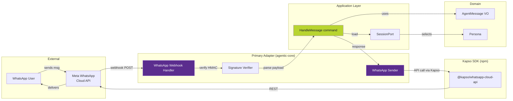

# WhatsApp Adapter Spec (Primary Adapter)

> Status: Draft — Pending implementation
> Date: 2026-04-13
> Author: Andres Pena Castillo
> Classification: Design spec for future primary adapter in `src/agentic_core/adapters/primary/whatsapp.py`

---

## Context

Vertivo (and other agentic-core consumers) need to engage users via WhatsApp
as a first-class channel. WhatsApp is the primary messaging app in LATAM
(90%+ penetration) and the #1 customer acquisition + retention channel for
B2C products in the region.

This adapter sits alongside existing primary adapters (`websocket.py`,
`grpc/`, `http_api.py`, `a2a.py`, `gateway.py`, `webhook.py`, `tui.py`, `cli.py`)
and receives incoming WhatsApp messages, translating them into application-layer
commands (primarily `HandleMessage`).

## Why a Custom Adapter (vs. SaaS like ManyChat/Landbot)

| Dimension | SaaS (ManyChat/Landbot) | agentic-core adapter |
|-----------|------------------------|---------------------|
| Context awareness | Limited — external bot sees only what user types | Full — bot can query domain state (sensors, crops, orders) |
| Cost at scale | $0.01-0.10/msg markup | Just WhatsApp Cloud API cost (~$0.005-0.05/msg) |
| Customization | Visual builder limitations | Full Python + domain services |
| Compliance | Data leaves your infra | Stays in your K8s |
| Multi-persona | Hard to implement | Native via PersonaRegistry |
| HITL escalation | Limited | Native via HumanEscalationRequested event |
| Tool use | No | Yes (via ToolPort) |

For Vertivo specifically: the bot needs to read live sensor data from the
customer's greenhouse, alert them about pH issues, remind them about harvest
readiness, and take orders for Caja Vertivo. A generic SaaS chatbot can't
do any of that.

## Architecture



## References

- [Kapso WhatsApp Cloud API JS SDK (npm)](https://www.npmjs.com/package/@kapso/whatsapp-cloud-api)
- [Kapso.ai](https://kapso.ai/) — managed layer on top of Meta Cloud API
- [whatsapp-broadcasts-example](https://github.com/gokapso/whatsapp-broadcasts-example) — broadcast patterns reference
- [whatsapp-cloud-api-js](https://github.com/gokapso/whatsapp-cloud-api-js) — JS client
- [gokapso/agent-skills](https://github.com/gokapso/agent-skills) — agent skill patterns
- [gokapso/whatsapp-cloud-inbox](https://github.com/gokapso/whatsapp-cloud-inbox) — inbox UX reference

**Note:** Kapso SDKs are TypeScript/JavaScript. This adapter will either:
- (A) Call Kapso SDK via subprocess/IPC from Python, or
- (B) Re-implement the wire protocol directly in Python (Meta Cloud API is REST + HMAC),
  using Kapso TS code as reference.

Recommendation: **Option B** — direct Python implementation. The Meta Cloud API
is simple enough (webhooks + REST POST), and avoids the cross-runtime complexity.

## Public Contract

### Inbound: Webhook Handler

**Endpoint:** `POST /webhooks/whatsapp`

Receives WhatsApp Cloud API webhook payloads. Verifies `X-Hub-Signature-256`
HMAC against configured `WHATSAPP_APP_SECRET`. Parses payload, extracts
message, and emits `HandleMessage` command.

```python
# src/agentic_core/adapters/primary/whatsapp.py (signature only)

class WhatsAppWebhookHandler:
    """Primary adapter: receives WhatsApp messages, emits HandleMessage commands."""

    def __init__(
        self,
        app_secret: str,
        verify_token: str,
        command_bus: CommandBus,  # from Application layer
        sender: "WhatsAppSender",
    ) -> None: ...

    async def handle_verification(self, mode: str, token: str, challenge: str) -> str:
        """Meta webhook verification (GET request, one-time setup)."""
        ...

    async def handle_webhook(
        self,
        signature: str,
        body: bytes,
    ) -> None:
        """Main entry: verify signature, parse, dispatch to app layer."""
        ...
```

### Outbound: Sender

```python
class WhatsAppSender:
    """Secondary-like adapter used by primary to reply to WhatsApp users."""

    async def send_text(self, to: str, text: str) -> MessageId: ...
    async def send_template(
        self, to: str, template_name: str, params: dict[str, Any]
    ) -> MessageId: ...
    async def send_image(self, to: str, image_url: str, caption: str | None) -> MessageId: ...
    async def send_interactive_buttons(
        self, to: str, body: str, buttons: list[Button]
    ) -> MessageId: ...
    async def mark_read(self, message_id: MessageId) -> None: ...
```

### Event Flow

1. User sends msg in WhatsApp
2. Meta POSTs to `/webhooks/whatsapp` with HMAC
3. `WhatsAppWebhookHandler.handle_webhook()` verifies and parses
4. Handler constructs `AgentMessage` value object from payload
5. Handler dispatches `HandleMessage` command to application layer
6. Application layer:
   - Loads/creates session via `SessionPort`
   - Selects persona (Rosa/Maria/Diego/etc based on phone number mapping)
   - Routes through `RoutingService` in domain
   - Executes LangGraph graph (for Vertivo: `customer_support_graph`)
   - Domain may emit events (e.g., `HumanEscalationRequested` if confused)
7. Graph produces response
8. Handler calls `WhatsAppSender.send_text()` to reply via Kapso/Cloud API
9. Response sent to user

## Domain Integration (Vertivo example)

For Vertivo, the chatbot needs live domain data. This requires the adapter
to call the Vertivo Serverpod backend via a `ToolPort`:

```python
# agentic-core defines the port; Vertivo implements it
class VertivoGreenhouseToolPort(Protocol):
    async def get_greenhouse_status(self, user_id: str) -> GreenhouseStatus: ...
    async def get_sensor_readings(self, device_id: str) -> list[SensorReading]: ...
    async def get_active_alerts(self, user_id: str) -> list[Alert]: ...
    async def place_caja_order(self, user_id: str, items: list[CajaItem]) -> OrderId: ...
    async def schedule_harvest_reminder(self, user_id: str, when: datetime) -> None: ...
```

This keeps agentic-core domain-agnostic: Vertivo-specific ports live in the
Vertivo monorepo, not here.

## Configuration (env vars)

| Variable | Description | Required |
|----------|-------------|:--------:|
| `WHATSAPP_APP_SECRET` | Meta app secret for HMAC verification | Yes |
| `WHATSAPP_VERIFY_TOKEN` | Token for webhook verification (GET handshake) | Yes |
| `WHATSAPP_PHONE_NUMBER_ID` | Meta phone number ID for sending | Yes |
| `WHATSAPP_ACCESS_TOKEN` | Meta Cloud API access token | Yes |
| `WHATSAPP_API_BASE_URL` | Default: `https://graph.facebook.com/v19.0` | No |
| `WHATSAPP_RATE_LIMIT_MSG_PER_SEC` | Default: 80 (Meta tier 2 limit) | No |

## Security Considerations

| Concern | Mitigation |
|---------|-----------|
| Webhook spoofing | HMAC signature verification (X-Hub-Signature-256) on every webhook |
| Token leakage | Tokens only in K8s secrets, never in code or logs |
| Phone number PII | Hash phone numbers before sending to analytics (PostHog) |
| Session hijacking | Session tied to verified phone number + Meta user ID |
| Rate limiting | Existing `RateLimit` middleware in agentic-core application layer |
| Message replay | Idempotency via `message_id` deduplication in session |
| GDPR/Ley 8968 (CR) | Explicit opt-in required. Deletion flow via `/baja` command. |

## Observability

- **Tracing**: OpenTelemetry span per webhook, links to Application-layer span
- **Metrics** (via `MetricsPort`):
  - `whatsapp_messages_received_total{direction="in"}`
  - `whatsapp_messages_sent_total{direction="out",type="text|template|image|interactive"}`
  - `whatsapp_webhook_duration_seconds` (histogram)
  - `whatsapp_signature_verification_failures_total`
  - `whatsapp_rate_limit_hits_total`
- **Logs**: Structured via `structlog`, phone numbers hashed
- **Langfuse**: Existing `LangfuseAdapter` traces LLM calls triggered by WhatsApp msgs

## Testing Strategy

### Unit tests
- Signature verification (valid/invalid/missing)
- Payload parsing (text, image, location, button, template reply, status update)
- Error paths (malformed JSON, missing fields, unsupported message types)

### Integration tests
- Full flow: webhook → command bus → response via mocked `WhatsAppSender`
- Multi-turn conversation with session continuity
- HITL escalation path

### E2E tests (staging only)
- Real Meta Cloud API sandbox number
- Send text/image/interactive messages
- Verify delivery receipts

## Deployment

- Deployed as part of the agentic-core runtime (no separate service)
- Webhook endpoint exposed via existing `http_api.py` primary adapter
  (route: `/webhooks/whatsapp`)
- HMAC secret and access token injected via K8s secret
- Horizontal Pod Autoscaler: scale on `whatsapp_messages_received_total` rate

## Broadcast Support (Outbound Campaigns)

Reference [whatsapp-broadcasts-example](https://github.com/gokapso/whatsapp-broadcasts-example).

For Vertivo marketing:
- Drip campaigns (welcome series, educational content)
- Harvest reminders (live data from greenhouse)
- Caja Vertivo order reminders
- PropTech partnership announcements

Implemented as:

```python
class WhatsAppBroadcaster:
    """Outbound broadcast helper (rate-limited, template-only for marketing)."""

    async def broadcast_template(
        self,
        template_name: str,
        recipients: list[PhoneNumber],
        params_per_recipient: dict[PhoneNumber, dict[str, Any]],
    ) -> BroadcastResult: ...
```

Broadcasts go through Meta's approved template system (required for
marketing messages outside 24hr customer service window).

## Inbox UX (Human Agent Takeover)

Reference [whatsapp-cloud-inbox](https://github.com/gokapso/whatsapp-cloud-inbox).

When `HumanEscalationRequested` event fires from domain, route to:
1. Hand off to human via internal inbox UI (future: TUI + web)
2. Notify on-call via Slack / email (existing `AlertPort`)
3. Pause bot for that session until human resolves

The inbox UI is a future `secondary adapter` or could be a separate Flutter app
that subscribes to the session's event stream via existing WebSocket adapter.

## Implementation Plan

| Step | Deliverable | Owner | Est. duration |
|------|------------|-------|--------------|
| 1 | Add `WHATSAPP_*` env vars to config + secrets template | backend | 1 hr |
| 2 | Implement `WhatsAppSignatureVerifier` + tests | backend | 2 hrs |
| 3 | Implement `WhatsAppWebhookHandler.handle_verification()` | backend | 1 hr |
| 4 | Implement `WhatsAppWebhookHandler.handle_webhook()` + payload parsing | backend | 4 hrs |
| 5 | Implement `WhatsAppSender` (text + template first) | backend | 3 hrs |
| 6 | Wire into `http_api.py` routes (`/webhooks/whatsapp`) | backend | 1 hr |
| 7 | Add metrics + structured logs | backend | 2 hrs |
| 8 | Integration tests | backend | 3 hrs |
| 9 | Deploy to staging with Meta sandbox number | devops | 2 hrs |
| 10 | Vertivo-specific ToolPort implementation (separate repo) | Vertivo backend | 6 hrs |
| 11 | Broadcast support | backend | 4 hrs |
| 12 | Inbox UX MVP | frontend | 8 hrs |
| **Total core adapter** | | | **~23 hrs** |
| **Total w/ broadcast + inbox** | | | **~35 hrs** |

## Open Questions

1. Do we build the broadcast system in agentic-core or as a separate Vertivo-specific
   service? Leaning toward core — useful for multiple tenants.
2. How do we handle multi-tenancy? Vertivo is one tenant; future consumers will be others.
   Options: phone number → tenant mapping in session port, or separate adapter instance per tenant.
3. Message template management: UI in agentic-core TUI? Or external (Meta Business Manager)?
4. What's the cold-start flow? User sends first message — how does bot know them?
   Likely: prompt for email/account on first msg, link account after verification.

## Non-Goals

- This adapter does NOT replace the existing WebSocket/HTTP API adapters
- This adapter does NOT handle Instagram, Messenger, or SMS (future separate adapters)
- This adapter does NOT implement the conversation graph logic — that lives in the
  consuming project's monorepo (e.g., Vertivo's `customer_support_graph`)

## Success Metrics (Vertivo consumer)

- >90% of customer inquiries resolved without human escalation (Mo 6)
- <2s median response time (P50)
- <5% webhook verification failures (false positives)
- <0.1% message delivery failures
- Referral rate uplift: customers 20%+ more likely to refer when bot is used

---

*Related specs:*
- `agentic-core/docs/specs/superpowers/` — superpowers patterns used by WhatsApp flows
- `vertivolatam/business-model/03-ejecucion-aceleracion/06-salida-al-mercado.md` — GTM context
