# Agentic Core — Phase 1 Design Spec

**Date:** 2026-03-25
**Status:** Draft
**Scope:** Phase 1 — Core + Transport + Runtime + foundational types for all phases

---

## 1. Overview

**agentic-core** is a production-ready Python 3.12+ library for AI agent orchestration. It is consumed as a shared dependency by any monorepo from any startup willing to integrate autonomous agents into their Kubernetes infrastructure via sidecar injection or standalone deployment.

The library provides:
- Hybrid transport (WebSocket + gRPC)
- LangGraph-based orchestration with pluggable graph patterns
- Unified memory (Redis + PostgreSQL + pgvector + FalkorDB)
- MCP bridge for external tool integration
- Meta-orchestration (GSD, Superpowers Flow, Auto Research)
- Full SRE observability (OpenTelemetry + Langfuse)
- Kubernetes-native deployment (Helm + ArgoCD)

**Critical constraint:** This library contains NO domain-specific graphs or business logic. All graphs live inside each project's own monorepo.

## 2. Architecture: Explicit Architecture (Hexagonal + DDD + CQRS)

Based on Herberto Graca's Explicit Architecture, organizing code by domain boundaries with strict dependency inversion.

### 2.1 Layer Diagram

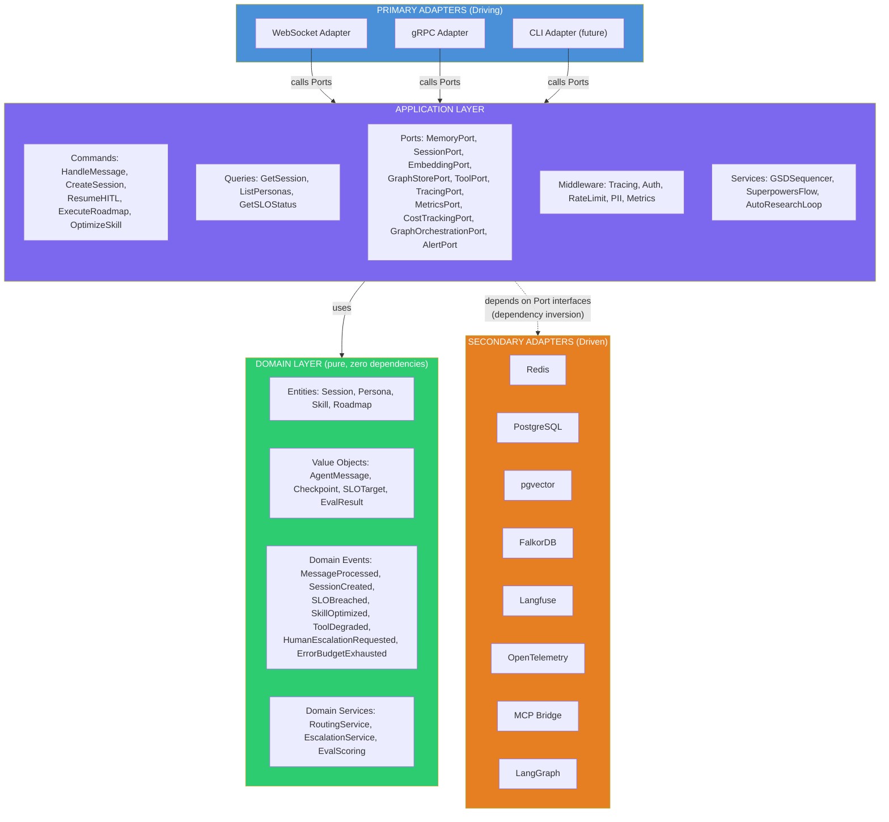

> **Dependency Rule:** ALL arrows point INWARD. Secondary adapters depend on Port interfaces defined in the Application layer, never the reverse.

### 2.2 Hexagonal Architecture (Ports & Adapters)

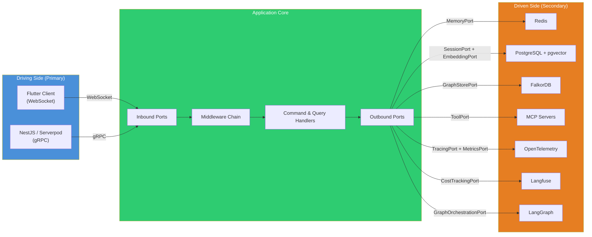

### 2.3 Key Principles

- **Ports** are interfaces defined by the domain's needs, not by tool APIs
- **Primary adapters** (WebSocket, gRPC) translate external protocols into application commands/queries
- **Secondary adapters** implement ports — swappable without touching domain or application layers
- **Domain events** decouple cross-component communication (SLOBreached → AlertPort → PagerDuty)
- **Composition Root** (`runtime.py`) is the ONLY place that knows about concrete implementations
- **CQRS**: Commands have side effects, Queries are read-only — separated at the handler level
- **Shared Kernel**: Minimal shared types (AgentMessage, SessionId, EventBus) — nothing else

### 2.4 Message Flow (Request Lifecycle)

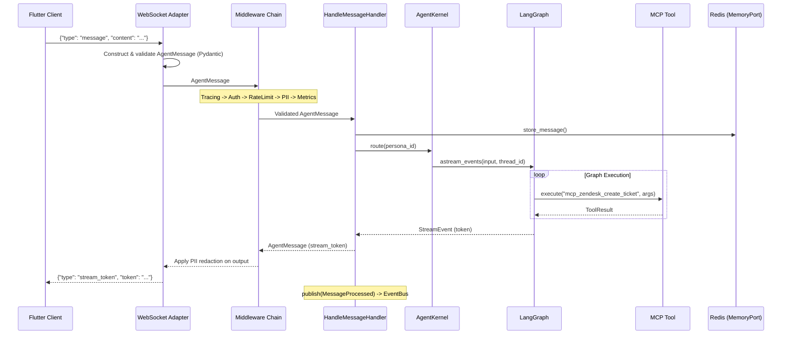

### 2.5 CQRS Flow

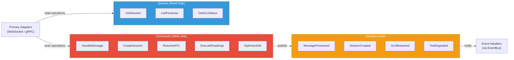

## 3. Folder Structure

```
agentic-core/
├── src/agentic_core/
│   ├── __init__.py
│   ├── shared_kernel/            # Minimal shared types + EventBus
│   │   ├── __init__.py
│   │   ├── types.py              # SessionId, PersonaId, TraceId
│   │   └── events.py             # DomainEvent ABC, EventBus
│   ├── domain/                   # PURE — zero external dependencies
│   │   ├── __init__.py
│   │   ├── entities/
│   │   │   ├── __init__.py
│   │   │   ├── session.py        # Session entity
│   │   │   ├── persona.py        # Persona entity + PersonaConfig
│   │   │   ├── skill.py          # SkillDefinition entity
│   │   │   └── roadmap.py        # Roadmap, Phase, RoadmapTask
│   │   ├── value_objects/
│   │   │   ├── __init__.py
│   │   │   ├── messages.py       # AgentMessage
│   │   │   ├── checkpoint.py     # Checkpoint
│   │   │   ├── slo.py            # SLOTarget, SLIValue
│   │   │   └── eval.py           # BinaryEvalRule, EvalResult
│   │   ├── events/
│   │   │   ├── __init__.py
│   │   │   └── domain_events.py  # MessageProcessed, SLOBreached, etc.
│   │   ├── services/
│   │   │   ├── __init__.py
│   │   │   ├── routing.py        # RoutingService
│   │   │   ├── escalation.py     # EscalationService
│   │   │   └── eval_scoring.py   # EvalScoring for Auto Research
│   │   └── enums.py              # SessionState, GraphTemplate, PersonaCapability
│   ├── application/              # Use cases, orchestrates domain
│   │   ├── __init__.py
│   │   ├── ports/                # ABC interfaces
│   │   │   ├── __init__.py
│   │   │   ├── memory.py         # MemoryPort
│   │   │   ├── session.py        # SessionPort
│   │   │   ├── embedding.py      # EmbeddingPort
│   │   │   ├── graph_store.py    # GraphStorePort
│   │   │   ├── tool.py           # ToolPort
│   │   │   ├── tracing.py        # TracingPort
│   │   │   ├── metrics.py        # MetricsPort
│   │   │   ├── cost_tracking.py  # CostTrackingPort
│   │   │   ├── graph.py          # GraphOrchestrationPort
│   │   │   └── alert.py          # AlertPort
│   │   ├── commands/
│   │   │   ├── __init__.py
│   │   │   ├── handle_message.py
│   │   │   ├── create_session.py
│   │   │   ├── resume_hitl.py
│   │   │   ├── execute_roadmap.py
│   │   │   └── optimize_skill.py
│   │   ├── queries/
│   │   │   ├── __init__.py
│   │   │   ├── get_session.py
│   │   │   ├── list_personas.py
│   │   │   └── get_slo_status.py
│   │   ├── middleware/
│   │   │   ├── __init__.py
│   │   │   ├── base.py           # Middleware ABC + chain builder
│   │   │   ├── tracing.py
│   │   │   ├── auth.py
│   │   │   ├── rate_limit.py
│   │   │   ├── pii_redaction.py
│   │   │   └── metrics.py
│   │   └── services/             # Meta-orchestration
│   │       ├── __init__.py
│   │       ├── gsd_sequencer.py
│   │       ├── superpowers_flow.py
│   │       └── auto_research.py
│   ├── adapters/
│   │   ├── __init__.py
│   │   ├── primary/              # DRIVING
│   │   │   ├── __init__.py
│   │   │   ├── websocket.py
│   │   │   └── grpc/
│   │   │       ├── __init__.py
│   │   │       ├── server.py
│   │   │       └── generated/    # From proto compilation
│   │   └── secondary/            # DRIVEN — implement Ports
│   │       ├── __init__.py
│   │       ├── redis_adapter.py
│   │       ├── postgres_adapter.py
│   │       ├── pgvector_adapter.py
│   │       ├── falkordb_adapter.py
│   │       ├── langfuse_adapter.py
│   │       ├── otel_adapter.py
│   │       ├── mcp_bridge_adapter.py
│   │       └── langgraph_adapter.py
│   ├── graph_templates/          # Pre-built LangGraph patterns
│   │   ├── __init__.py
│   │   ├── base.py               # BaseAgentGraph ABC
│   │   ├── react.py              # ReAct (default)
│   │   ├── plan_execute.py       # Plan-and-Execute
│   │   ├── reflexion.py          # Reflexion (self-critique)
│   │   ├── llm_compiler.py       # Parallel tool execution
│   │   ├── supervisor.py         # Multi-agent supervisor
│   │   ├── orchestrator.py       # GSD + Superpowers + AutoResearch
│   │   └── nodes/                # Reusable building blocks
│   │       ├── __init__.py
│   │       ├── planner.py
│   │       ├── reflector.py
│   │       ├── actor.py
│   │       ├── hitl.py
│   │       └── router.py
│   ├── config/
│   │   ├── __init__.py
│   │   └── settings.py           # AgenticSettings (Pydantic)
│   └── runtime.py                # Composition Root
├── proto/
│   └── agentic_core.proto        # gRPC service definition
├── deployment/
│   ├── helm/
│   │   └── agentic-core/
│   │       ├── Chart.yaml
│   │       ├── values.yaml
│   │       ├── values-sidecar.yaml
│   │       └── templates/
│   │           ├── deployment.yaml
│   │           ├── sidecar-injector.yaml
│   │           ├── service.yaml
│   │           ├── hpa.yaml
│   │           └── servicemonitor.yaml
│   ├── argocd/
│   │   ├── application.yaml
│   │   └── overlays/
│   │       ├── dev/
│   │       ├── staging/
│   │       └── production/
│   ├── terraform/
│   │   └── examples/
│   │       └── aws/              # EKS + RDS + ElastiCache
│   └── docker/
│       └── Dockerfile            # Multi-stage, non-root, distroless
├── .github/workflows/
│   ├── ci.yaml
│   ├── cd.yaml
│   └── release.yaml
├── tests/
│   ├── unit/
│   │   ├── domain/
│   │   ├── application/
│   │   └── adapters/
│   ├── integration/
│   └── load/
│       └── k6/
├── examples/
│   ├── simple_react_agent/
│   ├── multi_persona_supervisor/
│   └── flutter_websocket_client/
├── pyproject.toml
├── README.md
├── AGENTS.md
└── SLO.md
```

## 4. Core Types (Shared Kernel)

### 4.1 AgentMessage

```python
class AgentMessage(BaseModel, frozen=True):
    """Core value object. Pydantic model for runtime validation at transport boundary.
    Uses frozen=True for immutability. metadata is deep-frozen via validator."""

    id: str                          # UUID v7 (time-sortable, via uuid-utils)
    session_id: str
    persona_id: str
    role: Literal["user", "assistant", "system", "tool", "human_escalation"]
    content: str
    metadata: Mapping[str, Any]      # Immutable mapping (MappingProxyType)
    timestamp: datetime
    trace_id: str | None = None      # OTel correlation

    @field_validator("id")
    @classmethod
    def validate_uuid_v7(cls, v: str) -> str:
        parsed = uuid_utils.UUID(v)
        if parsed.version != 7:
            raise ValueError(f"Expected UUID v7, got v{parsed.version}")
        return v

    @field_validator("metadata", mode="before")
    @classmethod
    def freeze_metadata(cls, v: dict) -> Mapping[str, Any]:
        """Shallow-freezes top-level dict. Nested dicts remain mutable by design
        (metadata consumers may need to read nested structures without copy overhead)."""
        return MappingProxyType(v) if isinstance(v, dict) else v
```

Primary adapters (WebSocket, gRPC) are the **input validation boundary**: they construct `AgentMessage` from raw transport data. Pydantic validates all fields at construction time. Invalid data raises `ValidationError` which the adapter translates to a transport-specific error response.

### 4.2 EventBus

```python
class EventBus:
    """In-process async event dispatcher. Handlers are awaited sequentially.
    A failing handler logs the error and does NOT block subsequent handlers."""

    async def publish(self, event: DomainEvent) -> None:
        """Dispatches to all subscribed handlers sequentially. Errors are logged, not raised."""

    def subscribe(self, event_type: type[DomainEvent],
                  handler: Callable[[DomainEvent], Awaitable[None]]) -> None:
        """Register an async handler for a domain event type."""
```

Dispatch strategy: **sequential await, log-and-continue on error**. This ensures ordering guarantees while preventing one broken handler from disrupting the entire event chain. Handlers that need I/O (e.g., AlertPort calling PagerDuty) are awaited normally — they must handle their own timeouts.

## 5. Domain Layer

### 5.1 Entities

```python
class Session:
    """Conversation lifecycle. Enforces valid state transitions."""
    id: str                          # UUID v7
    persona_id: str
    user_id: str
    state: SessionState              # ACTIVE → PAUSED | ESCALATED | COMPLETED
    checkpoint_id: str | None        # LangGraph checkpoint reference
    created_at: datetime
    updated_at: datetime
    metadata: dict[str, Any]

    def transition_to(self, new_state: SessionState) -> None:
        """Raises InvalidTransitionError if transition is not allowed."""
```

#### Session State Machine

```mermaid
statediagram-v2
    [*] --> ACTIVE : CreateSession
    ACTIVE --> PAUSED : explicit pause / connection drop
    ACTIVE --> ESCALATED : HITL node / escalation rule
    ACTIVE --> COMPLETED : graph finished / user ended
    PAUSED --> ACTIVE : resume (within TTL)
    PAUSED --> COMPLETED : TTL expired
    ESCALATED --> ACTIVE : human responded
    COMPLETED --> [*]
```

```python

class Persona:
    """Agent persona loaded from YAML + optional code registration."""
    name: str
    role: str
    description: str
    graph_template: GraphTemplate     # Default: REACT
    skills: list[str]
    tools: list[str]                  # Supports wildcards: "mcp_zendesk_*"
    escalation_rules: list[EscalationRule]
    model_config: ModelConfig
    capabilities: PersonaCapabilities
    slo_targets: SLOTargets | None
    graph_cls: type[BaseAgentGraph] | None = None  # Set by @agent_persona decorator

class Skill:
    """Mutable skill definition with version history for Auto Research optimization."""
    name: str
    instructions: str                 # The mutable prompt/instructions
    version: int
    score_history: list[float]        # Track improvement over iterations
    created_at: datetime
    updated_at: datetime

class Roadmap:
    """Multi-phase execution plan for GSD Sequencer."""
    title: str
    objectives: list[str]             # Measurable success criteria
    phases: list[Phase]

class Phase:
    name: str
    tasks: list[RoadmapTask]
    gate: GateCondition               # Must pass before advancing

class RoadmapTask:
    id: str
    description: str
    spec: str                         # Detailed task specification
    verification_criteria: list[str]  # How to verify completion
    depends_on: list[str]             # Task IDs this depends on

class EscalationRule:
    condition: str                    # Safe expression (see Section 10.3)
    target: str                       # Persona name or "human"
    priority: str = "normal"          # "normal" | "urgent"
```

### 5.2 Domain Events

| Event | Trigger | Handled via Port |
|-------|---------|------------------|
| `MessageProcessed` | After graph completes | `ObservabilityPort`, SLO tracking |
| `SessionCreated` | New session | `ObservabilityPort` |
| `SLOBreached` | SLI exceeds target | `AlertPort` |
| `SkillOptimized` | Auto Research improves a skill | `MemoryPort` (stores new version) |
| `HumanEscalationRequested` | Graph hits HITL node | Primary adapter (transport sends to client) |
| `ErrorBudgetExhausted` | Burn rate too high | `AlertPort` |
| `ToolDegraded` | Tool fails healthcheck or execution | `ToolPort` (deregisters), `AlertPort` |
| `ToolRecovered` | MCP server reconnects, tool re-passes healthcheck | `ToolPort` (re-registers) |

Note: Domain events reference Ports, never concrete adapters. The Composition Root wires concrete handlers.

### 5.3 Domain Services

**RoutingService**: Given a persona_id, resolves the graph template + tools + memory config.
**EscalationService**: Evaluates escalation rules from PersonaConfig, decides target (another persona or human).
**EvalScoring**: Applies BinaryEvalRules to batch results, produces aggregate scores.

### 5.4 Enums

```python
class SessionState(str, Enum):
    ACTIVE = "active"
    PAUSED = "paused"
    ESCALATED = "escalated"
    COMPLETED = "completed"

class GraphTemplate(str, Enum):
    REACT = "react"                    # Default
    PLAN_EXECUTE = "plan-and-execute"
    REFLEXION = "reflexion"
    LLM_COMPILER = "llm-compiler"
    SUPERVISOR = "supervisor"
    ORCHESTRATOR = "orchestrator"      # GSD + Superpowers + Auto Research
```

## 6. Application Layer

### 6.1 Ports

```python
class MemoryPort(ABC):
    """Short-term conversation memory."""
    @abstractmethod
    async def store_message(self, message: AgentMessage) -> None: ...
    @abstractmethod
    async def get_messages(self, session_id: str, limit: int = 50) -> list[AgentMessage]: ...
    @abstractmethod
    async def get_context_window(self, session_id: str, max_tokens: int) -> list[AgentMessage]: ...

class SessionPort(ABC):
    """Session CRUD + checkpoint persistence."""
    @abstractmethod
    async def create(self, session: Session) -> None: ...
    @abstractmethod
    async def get(self, session_id: str) -> Session | None: ...
    @abstractmethod
    async def update(self, session: Session) -> None: ...
    @abstractmethod
    async def store_checkpoint(self, session_id: str, checkpoint_data: bytes) -> str: ...
    @abstractmethod
    async def load_checkpoint(self, checkpoint_id: str) -> bytes: ...

class EmbeddingPort(ABC):
    """Semantic search over vector embeddings."""
    @abstractmethod
    async def store(self, text: str, embedding: list[float], metadata: dict) -> None: ...
    @abstractmethod
    async def search(self, query_embedding: list[float], top_k: int = 5) -> list[SearchResult]: ...

class GraphStorePort(ABC):
    """Knowledge graph for entity relations."""
    @abstractmethod
    async def store_entity(self, entity: Entity, relations: list[Relation]) -> None: ...
    @abstractmethod
    async def query(self, cypher: str) -> list[dict]: ...

class ToolPort(ABC):
    """Execute tools by name. Implemented by MCPBridgeAdapter.

    DESIGN NOTE (OpenClaw issue #50131 mitigation): Tools MUST be validated at
    registration time, not just call time. The healthcheck_tool method performs
    a dry-run to verify the tool can execute in the current runtime context.
    Tools that fail healthcheck are NEVER registered — preventing "phantom tools"
    that are visible to the LLM but fail at execution time."""
    @abstractmethod
    async def execute(self, tool_name: str, args: dict) -> ToolResult: ...
    @abstractmethod
    async def list_tools(self, persona_id: str) -> list[ToolInfo]: ...
    @abstractmethod
    async def healthcheck_tool(self, tool_name: str) -> ToolHealthStatus: ...
    @abstractmethod
    async def deregister_tool(self, tool_name: str) -> None:
        """Dynamically remove a tool that has become unhealthy."""

class GraphOrchestrationPort(ABC):
    """Compile and execute LangGraph graphs. Implemented by LangGraphAdapter."""
    @abstractmethod
    async def compile_graph(self, graph: BaseAgentGraph, checkpoint_id: str | None) -> CompiledGraph: ...
    @abstractmethod
    async def stream_execution(self, compiled: CompiledGraph, input: dict) -> AsyncIterator[StreamEvent]: ...

class TracingPort(ABC):
    """Distributed tracing (spans). Implemented by OTelAdapter."""
    @abstractmethod
    def start_span(self, name: str, attributes: dict) -> Span: ...
    @abstractmethod
    def end_span(self, span: Span) -> None: ...

class MetricsPort(ABC):
    """Prometheus-style metrics. Implemented by OTelAdapter."""
    @abstractmethod
    def increment_counter(self, name: str, labels: dict, value: float = 1) -> None: ...
    @abstractmethod
    def observe_histogram(self, name: str, labels: dict, value: float) -> None: ...

class CostTrackingPort(ABC):
    """LLM cost tracking. Implemented by LangfuseAdapter."""
    @abstractmethod
    async def record_generation(self, model: str, input_tokens: int,
                                 output_tokens: int, metadata: dict) -> None: ...

class AlertPort(ABC):
    """Fire alerts to external systems (PagerDuty, Slack, etc.)."""
    @abstractmethod
    async def fire(self, severity: str, summary: str, details: dict) -> None: ...
```

| Port | Implemented by |
|------|----------------|
| `MemoryPort` | `RedisAdapter` |
| `SessionPort` | `PostgresAdapter` |
| `EmbeddingPort` | `PgVectorAdapter` |
| `GraphStorePort` | `FalkorDBAdapter` |
| `ToolPort` | `MCPBridgeAdapter` |
| `GraphOrchestrationPort` | `LangGraphAdapter` |
| `TracingPort` | `OTelAdapter` |
| `MetricsPort` | `OTelAdapter` |
| `CostTrackingPort` | `LangfuseAdapter` |
| `AlertPort` | `AlertManagerAdapter` (stub) |

Note: The former `ObservabilityPort` is split into `TracingPort`, `MetricsPort`, and `CostTrackingPort` to avoid ambiguous multi-adapter composition. Each port has exactly one adapter.

### 6.2 Commands (side effects)

- **HandleMessage**: Receives message → routes to persona graph → streams response → publishes MessageProcessed
- **CreateSession**: Initializes session entity + checkpoint in PostgreSQL
- **ResumeHITL**: Loads checkpoint, injects human response, resumes graph execution
- **ExecuteRoadmap**: GSD Sequencer runs phases sequentially with isolated context
- **OptimizeSkill**: Auto Research loop — batch execute, eval, mutate, iterate

### 6.3 Queries (read-only)

- **GetSession**: Returns session state + metadata
- **ListPersonas**: Returns discovered persona configs
- **GetSLOStatus**: Returns current SLI values vs targets, error budget remaining

### 6.4 Middleware Chain

Composable, ASGI-inspired. Each middleware wraps the next:

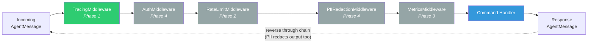

- **TracingMiddleware**: Creates OTel span, injects trace_id into AgentMessage
- **AuthMiddleware**: Validates JWT/API key, extracts user_id
- **RateLimitMiddleware**: Token bucket per session/user (Redis-backed)
- **PIIRedactionMiddleware**: Strips emails, phones, SSNs, credit cards from content
- **MetricsMiddleware**: Records request duration, token count, status

### 6.5 Application Services (Meta-Orchestration)

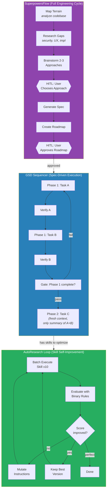

**GSDSequencer**: Spec-Driven Development. Breaks complex tasks into sub-agent executions with isolated context. Each task gets a fresh context with only a compressed summary of prior results.

**SuperpowersFlow**: Full engineering cycle — map terrain → research gaps → brainstorm 2-3 approaches → HITL choose → generate spec → create roadmap → HITL approve → delegate to GSD → final verification.

**AutoResearchLoop**: Skill self-improvement. Batch execute skill → evaluate with binary rules → mutate instructions → iterate until convergence or max iterations.

## 7. Primary Adapters

### 7.1 WebSocket Adapter

Based on `websockets` library. Features:
- Heartbeat: ping/pong every 30s
- Auto-reconnection hints: close code 1012
- Streaming: token-by-token for LLM responses
- Binary frames: ElevenLabs voice audio (base64)
- Session multiplexing: multiple personas per connection

Protocol:
```json
// Session lifecycle
→ { "type": "create_session", "persona_id": "...", "user_id": "..." }
← { "type": "session_created", "session_id": "..." }
→ { "type": "close_session", "session_id": "..." }
← { "type": "session_closed", "session_id": "..." }

// Messaging
→ { "type": "message", "session_id": "...", "persona_id": "...", "content": "..." }
← { "type": "stream_start", "session_id": "..." }
← { "type": "stream_token", "token": "..." }
← { "type": "stream_end" }

// Human-in-the-loop
← { "type": "human_escalation", "session_id": "...", "prompt": "..." }
→ { "type": "human_response", "session_id": "...", "content": "..." }

// Voice
← { "type": "audio", "session_id": "...", "data": "<base64>" }

// Errors
← { "type": "error", "session_id": "...", "code": "...", "message": "..." }
// Error codes: invalid_session, invalid_persona, rate_limited, auth_failed,
//              internal_error, session_limit_exceeded
```

Connection drop behavior: All active sessions for the connection transition to `PAUSED` state. Checkpoints are persisted. Sessions are resumable within a configurable TTL (default 30 minutes). Max concurrent sessions per connection: configurable, default 10.

### 7.2 gRPC Adapter

```protobuf
service AgentService {
  rpc SendMessage(AgentRequest) returns (stream AgentResponse);
  rpc CreateSession(CreateSessionRequest) returns (SessionInfo);
  rpc GetSession(GetSessionRequest) returns (SessionInfo);
  rpc ResumeHITL(HumanResponse) returns (stream AgentResponse);
  rpc ListPersonas(Empty) returns (PersonaList);
  rpc HealthCheck(Empty) returns (HealthStatus);
}

message HumanResponse {
  string session_id = 1;
  string content = 2;
}

message AgentResponse {
  oneof payload {
    StreamToken token = 1;
    StreamEnd end = 2;
    HumanEscalation escalation = 3;
    AudioChunk audio = 4;
    ErrorDetail error = 5;
  }
}
```

## 8. Secondary Adapters

### 8.1 Memory Adapters

- **RedisAdapter** → implements `MemoryPort`: conversation cache, session hot state, pub/sub
- **PostgresAdapter** → implements `SessionPort`: sessions, checkpoints, audit log
- **PgVectorAdapter** → implements `EmbeddingPort`: semantic search, RAG embeddings
- **FalkorDBAdapter** → implements `GraphStorePort`: knowledge graph, entity relations

### 8.2 Tool Adapters

- **MCPBridgeAdapter** → implements `ToolPort`: discovers MCP servers (stdio/SSE/streamable-http), registers tools with `mcp_{server}_{tool}` naming, safe env resolution, error sanitization
- **LangGraphAdapter** → implements `GraphOrchestrationPort`: graph compilation, checkpoint management, graph template instantiation, streaming execution

### 8.4 Tool Health & Phantom Tool Prevention

Lesson learned from OpenClaw issue #50131: tools that are visible to the LLM but fail at runtime cause hallucinated responses and silent failures. agentic-core prevents this with a **three-layer defense**:

**Layer 1 — Registration-time healthcheck:**
When `MCPBridgeAdapter.start()` discovers tools from MCP servers, each tool undergoes a dry-run healthcheck before registration. Tools that fail are logged as warnings and excluded from `list_tools()` — the LLM never sees them.

**Layer 2 — Single runtime context:**
Unlike OpenClaw's dual loading paths (gateway vs chat/agent), `AgentRuntime` is the single Composition Root. The `ToolPort` instance injected into command handlers is always the same object with the same runtime capabilities, regardless of which transport (WebSocket or gRPC) originated the request.

**Layer 3 — Runtime degradation handling:**
If a previously healthy tool fails at execution time (e.g., MCP server disconnected), the adapter:
1. Returns `ToolResult(success=False, error=ToolError(code="capability_missing", retriable=False))`
2. Publishes `ToolDegraded` domain event
3. Dynamically deregisters the tool via `deregister_tool()`
4. On MCP server reconnection, re-runs healthcheck and re-registers if healthy

```mermaid
statediagram-v2
    [*] --> Discovery : MCPBridge.start()
    Discovery --> Healthcheck : tool found
    Healthcheck --> Registered : healthcheck passed
    Healthcheck --> Excluded : healthcheck failed
    Excluded --> [*] : logged as warning, LLM never sees tool

    Registered --> Healthy : serving requests
    Healthy --> Degraded : execution failure / MCP disconnect
    Degraded --> Deregistered : deregister_tool() + ToolDegraded event
    Deregistered --> Healthcheck : MCP server reconnects
    Healthy --> Healthy : successful execution

    note right of Degraded : LLM stops seeing tool immediately
    note right of Healthy : ToolRecovered event on re-registration
```

```python
class ToolHealthStatus(BaseModel):
    tool_name: str
    healthy: bool
    reason: str | None = None        # Why unhealthy

class ToolResult(BaseModel):
    success: bool
    output: str | None = None
    error: ToolError | None = None

class ToolError(BaseModel):
    code: Literal["not_found", "execution_failed", "capability_missing", "timeout"]
    message: str
    retriable: bool
```

### 8.3 Observability Adapters

- **OTelAdapter** → implements `TracingPort` + `MetricsPort`: Prometheus metrics on `/metrics`, Jaeger/OTLP trace export
- **LangfuseAdapter** → implements `CostTrackingPort`: per-execution cost tracking, trace visualization, FinOps reporting

## 9. Graph Templates

Selectable via `graph_template` field in persona YAML. Default: `react`.

| Template | Use case | Pattern |
|----------|---------|---------|
| `react` | Simple Q&A with tools (80% of cases) | Thought → Action → Observation → loop |
| `plan-and-execute` | Multi-step complex tasks | Plan → Execute each → Replan |
| `reflexion` | Quality-critical outputs | Act → Self-critique → Retry |
| `llm-compiler` | High throughput, independent tools | Plan DAG → Parallel execution |
| `supervisor` | Multi-persona collaboration | Supervisor routes to specialists |
| `orchestrator` | Full GSD + Superpowers + Auto Research | Meta-orchestration pattern |

Building block nodes (reusable across templates): `PlannerNode`, `ReflectorNode`, `ActorNode`, `HITLNode`, `RouterNode`.

Consumer can use templates OR build fully custom graphs by extending `BaseAgentGraph`.

#### Graph Template Topologies

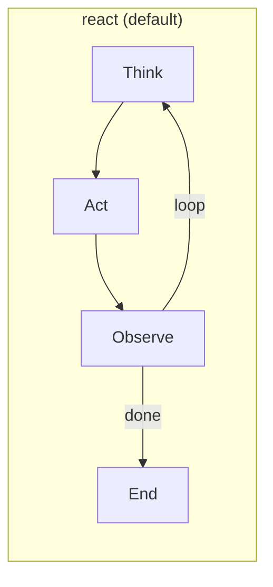

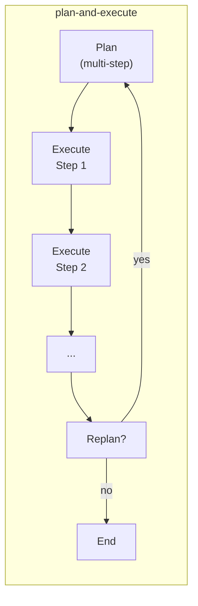

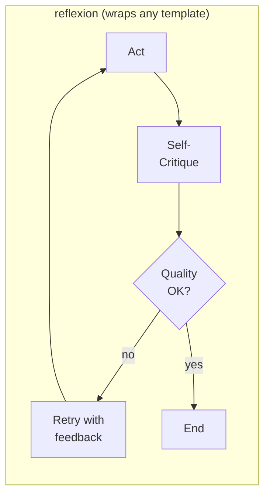

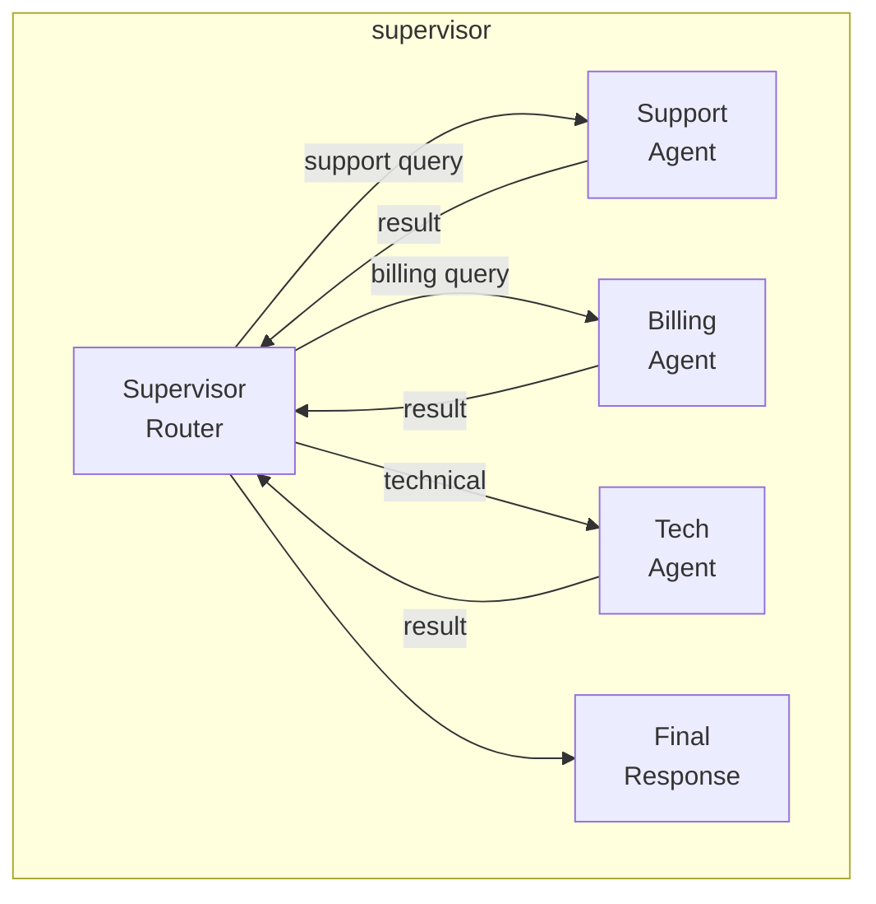

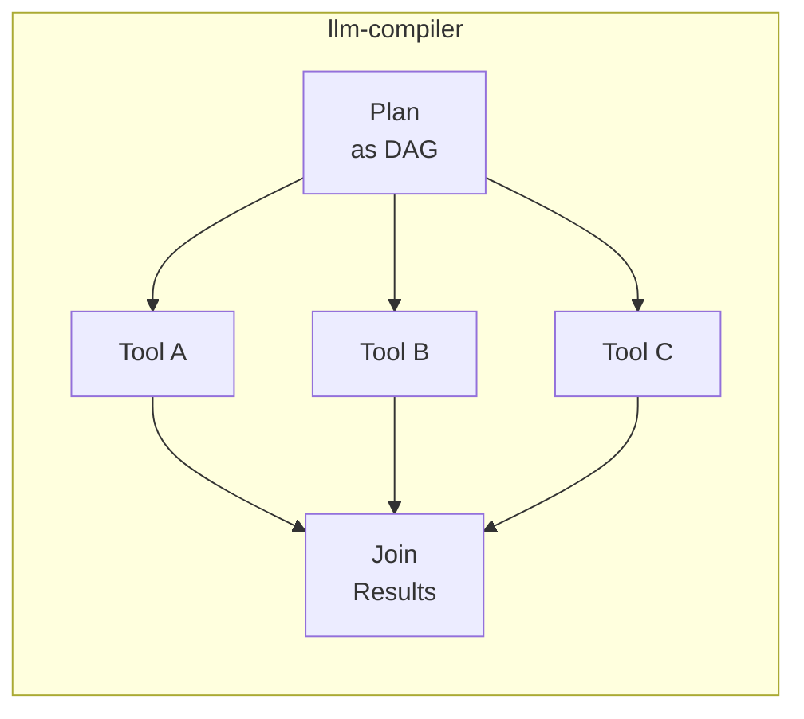

### 9.1 Decision Tree (for AGENTS.md)

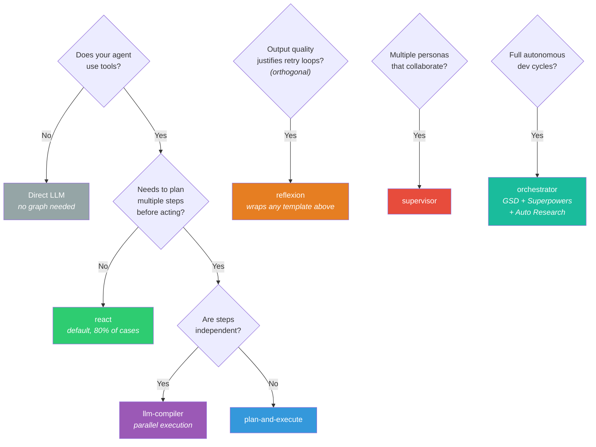

Note: `reflexion` is an orthogonal concern — it can wrap any base template to add self-critique. For example, `plan-and-execute` + `reflexion` means each execution step gets a self-critique pass before proceeding.

## 10. Persona System (Hybrid YAML + Code)

### 10.1 YAML Definition (edited by PM/Product)

```yaml
name: support-agent
role: "Customer support specialist"
description: "Handles customer inquiries"
graph_template: react
skills:
  - knowledge-base-search
  - ticket-creation
tools:
  - mcp_zendesk_*
  - rag_search
  - escalate_to_human
escalation_rules:
  - condition: "billing_amount > 500"
    target: "billing-agent"
  - condition: "sentiment < -0.7"
    target: "human"
    priority: "urgent"
model_config:
  provider: "anthropic"
  model: "claude-sonnet-4-6"
  temperature: 0.3
capabilities:
  gsd_enabled: false
  superpowers_flow: false
  auto_research: false
slo_targets:
  latency_p99_ms: 5000
  success_rate: 0.995
```

### 10.2 Code Registration (by engineer)

```python
@agent_persona("support-agent")
class SupportGraph(BaseAgentGraph):
    def build_graph(self) -> StateGraph:
        # Custom graph logic — overrides graph_template from YAML
        ...
```

When a code class is registered for a persona, it overrides the YAML `graph_template`. When no class is registered, the YAML template is used.

### 10.3 Escalation Rule Evaluation

Escalation rule conditions (e.g., `"billing_amount > 500"`) are evaluated using a **safe restricted expression evaluator** (`simpleeval` library) that disallows imports, attribute access, and arbitrary function calls. Python's built-in code execution is NEVER used for condition evaluation.

Available context variables in the condition:
- `sentiment`: float (-1.0 to 1.0, from latest message analysis)
- `message_count`: int (messages in current session)
- `billing_amount`: float (if available from session metadata)
- `error_count`: int (consecutive errors in current session)
- `duration_minutes`: float (session duration)
- Custom variables from `session.metadata`

Allowed operators: `>`, `<`, `>=`, `<=`, `==`, `!=`, `and`, `or`, `not`, `in`.

## 11. Configuration

```python
class AgenticSettings(BaseSettings):
    mode: Literal["sidecar", "standalone"] = "standalone"
    ws_host: str = "0.0.0.0"
    ws_port: int = 8765
    grpc_host: str = "0.0.0.0"     # sidecar → forced to 127.0.0.1
    grpc_port: int = 50051
    redis_url: str
    postgres_dsn: str
    falkordb_url: str
    otel_endpoint: str | None = None
    langfuse_public_key: str | None = None
    langfuse_secret_key: str | None = None
    rate_limit_rpm: int = 60
    pii_redaction_enabled: bool = True
    personas_dir: str = "agents/"
    mcp: MCPBridgeConfig = MCPBridgeConfig()
    model_config = SettingsConfigDict(env_prefix="AGENTIC_")

class MCPServerEntry(BaseModel):
    transport: Literal["stdio", "sse", "streamable-http"]
    command: str | None = None          # stdio
    args: list[str] = []                # stdio
    url: str | None = None              # sse / streamable-http
    headers: dict[str, str] = {}        # sse / streamable-http
    env: dict[str, str] = {}            # ${VAR} syntax, safe-resolved
    description: str = ""
    keywords: list[str] = []

class MCPBridgeConfig(BaseModel):
    mode: Literal["direct", "router"] = "direct"
    servers: dict[str, MCPServerEntry] = {}
    tool_prefix: bool = True
    reconnect_interval_ms: int = 30_000
    connection_timeout_ms: int = 10_000
    request_timeout_ms: int = 60_000
```

Sidecar mode forces `ws_host` and `grpc_host` to `127.0.0.1`.

## 12. Deployment

### 12.1 Modes

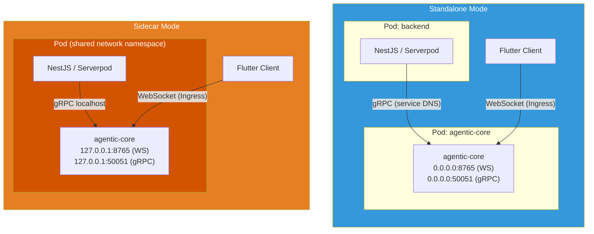

- **Standalone**: Own Deployment/StatefulSet. Scales independently. Binds 0.0.0.0.
- **Sidecar**: Container in same Pod as backend. Binds 127.0.0.1. Shares Pod network.

Helm chart supports both via `values.yaml` / `values-sidecar.yaml`.

### 12.2 CI/CD

- **ci.yaml**: ruff lint → mypy type check → pytest (unit only in Phase 1; integration from Phase 2 via `docker-compose.test.yaml` with Redis, PostgreSQL, FalkorDB) → trivy security scan. Coverage threshold: 80% minimum.
- **cd.yaml**: Docker multi-stage build → push to registry (on main merge)
- **release.yaml**: Semantic versioning → PyPI publish (on tag)

### 12.3 Logging Strategy

`structlog` is the standard logger, configured as a bound logger per-request with automatic context injection:

```python
# Every request gets a logger bound with:
log = structlog.get_logger().bind(
    trace_id=message.trace_id,
    session_id=message.session_id,
    persona_id=message.persona_id,
)
```

Log levels:
- `DEBUG`: Graph node transitions, tool call details (disabled in production)
- `INFO`: Session created/completed, message processed, persona loaded
- `WARNING`: HITL escalation, SLO approaching threshold, MCP reconnection
- `ERROR`: Graph execution failure, adapter connection lost, invalid input rejected

Output format: JSON in production (for Loki/ELK ingestion), console-colored in development. Configured via `AGENTIC_LOG_FORMAT=json|console`.

### 12.4 GitOps

```mermaid
graph LR
    DEV["Developer"] -->|"git push"| GH["GitHub<br/>(main branch)"]
    GH -->|"trigger"| CI["CI: lint + type<br/>+ test + scan"]
    CI -->|"pass"| CD["CD: Docker build<br/>+ push to registry"]
    CD -->|"update image tag in"| GITOPS["GitOps Repo<br/>(k8s manifests)"]
    GITOPS -->|"ArgoCD detects change"| DEV_C["Dev Cluster<br/><i>auto-sync</i>"]
    DEV_C -->|"manual approval"| STG["Staging Cluster"]
    STG -->|"manual approval"| PROD["Production Cluster"]

    style CI fill:#F39C12,color:#fff
    style CD fill:#3498DB,color:#fff
    style DEV_C fill:#2ECC71,color:#fff
    style STG fill:#E67E22,color:#fff
    style PROD fill:#E74C3C,color:#fff
```

ArgoCD Application with app-of-apps pattern. Kustomize overlays for dev/staging/production. Environment promotion via manual sync gates.

## 13. Implementation Phases

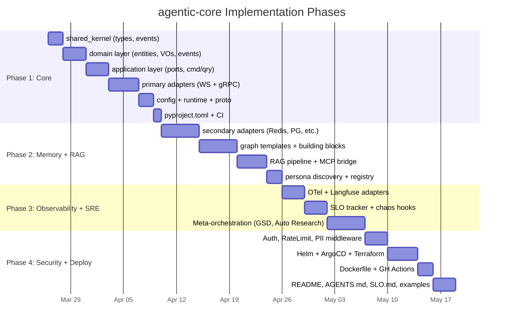

### Phase 1 (this spec): Core + Transport + Runtime
- shared_kernel (types, events)
- domain layer (entities, value objects, events, services, enums)
- application layer (ports ABCs, command/query handler skeletons, middleware base ABC + chain builder only)
- primary adapters (WebSocket + gRPC)
- config + runtime composition root
- proto definitions
- pyproject.toml + CI (unit tests only; integration tests require Phase 2 infra)

**Middleware note:** Phase 1 delivers only `base.py` (Middleware ABC + chain builder) and `tracing.py` (with a no-op fallback when OTel is absent). Concrete middleware implementations are mapped to their dependency phases:
- `TracingMiddleware` → Phase 1 (no-op fallback) + Phase 3 (OTel wired)
- `RateLimitMiddleware` → Phase 2 (requires Redis)
- `AuthMiddleware` → Phase 4 (requires PyJWT)
- `PIIRedactionMiddleware` → Phase 4 (requires presidio)
- `MetricsMiddleware` → Phase 3 (requires OTel)

### Phase 2: Memory + RAG + LangGraph
- secondary adapters (Redis, PostgreSQL, pgvector, FalkorDB)
- graph templates (react, plan-execute, reflexion, llm-compiler, supervisor)
- building block nodes
- RAG pipeline
- MCP bridge adapter
- persona discovery + registry

### Phase 3: Observability + SRE + Meta-Orchestration
- OTel + Langfuse adapters
- SLO tracker + error budget
- Chaos hooks
- Alert stubs
- GSD Sequencer, Superpowers Flow, Auto Research Loop
- Orchestrator graph template

### Phase 4: Security + Deployment + Docs
- Auth, RateLimit, PII middleware implementations
- Helm chart + ArgoCD manifests + Terraform examples
- Dockerfile
- GitHub Actions workflows
- README.md, AGENTS.md, SLO.md
- Examples (simple_react_agent, multi_persona_supervisor, flutter_websocket_client)
- k6 load tests

## 14. Dependencies (Phase 1)

```toml
[project]
requires-python = ">=3.12"
dependencies = [
    "pydantic>=2.0",
    "pydantic-settings>=2.0",
    "websockets>=13.0",
    "grpcio>=1.60",
    "grpcio-tools>=1.60",
    "structlog>=24.0",
    "pyyaml>=6.0",
    "uuid-utils>=0.9",
    "simpleeval>=1.0",
]

[project.optional-dependencies]
all = [
    "langgraph>=0.3",
    "langchain-core>=0.3",
    "redis>=5.0",
    "asyncpg>=0.30",
    "pgvector>=0.3",
    "falkordb>=1.0",
    "opentelemetry-api>=1.20",
    "opentelemetry-sdk>=1.20",
    "langfuse>=2.0",
    "presidio-analyzer>=2.2",
    "mcp>=1.0",
]
```
