# Agentic Core — Phase 1 Design Spec

**Date:** 2026-03-25
**Status:** Draft
**Scope:** Phase 1 — Core + Transport + Runtime + foundational types for all phases

---

## 1. Overview

**agentic-core** is a production-ready Python 3.12+ library for AI agent orchestration. It is consumed as a shared dependency by any monorepo from any startup willing to integrate autonomous agents into their Kubernetes infrastructure via sidecar injection or standalone deployment.

The library provides:
- Hybrid transport (WebSocket + gRPC)
- LangGraph-based orchestration with pluggable graph patterns
- Unified memory (Redis + PostgreSQL + pgvector + FalkorDB)
- MCP bridge for external tool integration
- Meta-orchestration (GSD, Superpowers Flow, Auto Research)
- Full SRE observability (OpenTelemetry + Langfuse)
- Kubernetes-native deployment (Helm + ArgoCD)

**Critical constraint:** This library contains NO domain-specific graphs or business logic. All graphs live inside each project's own monorepo.

## 2. Architecture: Explicit Architecture (Hexagonal + DDD + CQRS)

Based on Herberto Graca's Explicit Architecture, organizing code by domain boundaries with strict dependency inversion.

### 2.1 Layer Diagram

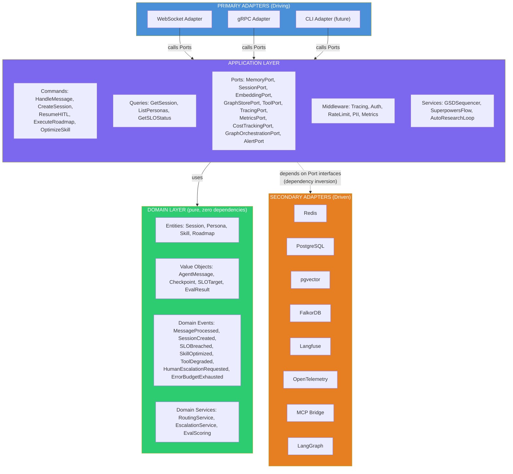

> **Dependency Rule:** ALL arrows point INWARD. Secondary adapters depend on Port interfaces defined in the Application layer, never the reverse.

### 2.2 Hexagonal Architecture (Ports & Adapters)

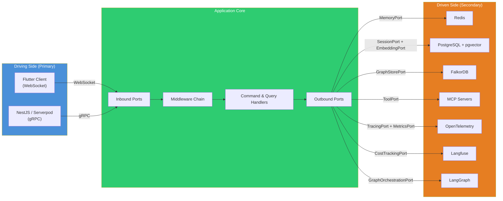

### 2.3 Key Principles

- **Ports** are interfaces defined by the domain's needs, not by tool APIs
- **Primary adapters** (WebSocket, gRPC) translate external protocols into application commands/queries
- **Secondary adapters** implement ports — swappable without touching domain or application layers
- **Domain events** decouple cross-component communication (SLOBreached → AlertPort → PagerDuty)
- **Composition Root** (`runtime.py`) is the ONLY place that knows about concrete implementations
- **CQRS**: Commands have side effects, Queries are read-only — separated at the handler level
- **Shared Kernel**: Minimal shared types (AgentMessage, SessionId, EventBus) — nothing else

### 2.4 Message Flow (Request Lifecycle)

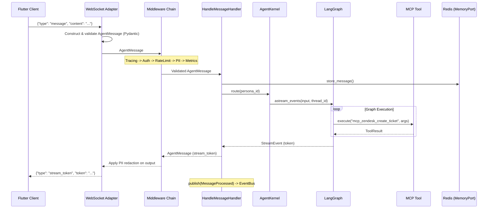

### 2.5 CQRS Flow

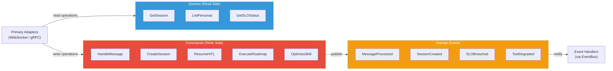

## 3. Folder Structure

```
agentic-core/
├── src/agentic_core/
│   ├── __init__.py
│   ├── shared_kernel/            # Minimal shared types + EventBus
│   │   ├── __init__.py
│   │   ├── types.py              # SessionId, PersonaId, TraceId
│   │   └── events.py             # DomainEvent ABC, EventBus
│   ├── domain/                   # PURE — zero external dependencies
│   │   ├── __init__.py
│   │   ├── entities/
│   │   │   ├── __init__.py
│   │   │   ├── session.py        # Session entity
│   │   │   ├── persona.py        # Persona entity + PersonaConfig
│   │   │   ├── skill.py          # SkillDefinition entity
│   │   │   └── roadmap.py        # Roadmap, Phase, RoadmapTask
│   │   ├── value_objects/
│   │   │   ├── __init__.py
│   │   │   ├── messages.py       # AgentMessage
│   │   │   ├── checkpoint.py     # Checkpoint
│   │   │   ├── slo.py            # SLOTarget, SLIValue
│   │   │   └── eval.py           # BinaryEvalRule, EvalResult
│   │   ├── events/
│   │   │   ├── __init__.py
│   │   │   └── domain_events.py  # MessageProcessed, SLOBreached, etc.
│   │   ├── services/
│   │   │   ├── __init__.py
│   │   │   ├── routing.py        # RoutingService
│   │   │   ├── escalation.py     # EscalationService
│   │   │   └── eval_scoring.py   # EvalScoring for Auto Research
│   │   └── enums.py              # SessionState, GraphTemplate, PersonaCapability
│   ├── application/              # Use cases, orchestrates domain
│   │   ├── __init__.py
│   │   ├── ports/                # ABC interfaces
│   │   │   ├── __init__.py
│   │   │   ├── memory.py         # MemoryPort
│   │   │   ├── session.py        # SessionPort
│   │   │   ├── embedding_provider.py  # EmbeddingProviderPort
│   │   │   ├── embedding_store.py    # EmbeddingStorePort
│   │   │   ├── graph_store.py    # GraphStorePort
│   │   │   ├── tool.py           # ToolPort
│   │   │   ├── tracing.py        # TracingPort
│   │   │   ├── metrics.py        # MetricsPort
│   │   │   ├── cost_tracking.py  # CostTrackingPort
│   │   │   ├── logging.py        # LoggingPort
│   │   │   ├── graph.py          # GraphOrchestrationPort
│   │   │   └── alert.py          # AlertPort
│   │   ├── commands/
│   │   │   ├── __init__.py
│   │   │   ├── handle_message.py
│   │   │   ├── create_session.py
│   │   │   ├── resume_hitl.py
│   │   │   ├── execute_roadmap.py
│   │   │   └── optimize_skill.py
│   │   ├── queries/
│   │   │   ├── __init__.py
│   │   │   ├── get_session.py
│   │   │   ├── list_personas.py
│   │   │   └── get_slo_status.py
│   │   ├── middleware/
│   │   │   ├── __init__.py
│   │   │   ├── base.py           # Middleware ABC + chain builder
│   │   │   ├── tracing.py
│   │   │   ├── auth.py
│   │   │   ├── rate_limit.py
│   │   │   ├── pii_redaction.py
│   │   │   └── metrics.py
│   │   └── services/             # Meta-orchestration
│   │       ├── __init__.py
│   │       ├── gsd_sequencer.py
│   │       ├── superpowers_flow.py
│   │       └── auto_research.py
│   ├── adapters/
│   │   ├── __init__.py
│   │   ├── primary/              # DRIVING
│   │   │   ├── __init__.py
│   │   │   ├── websocket.py
│   │   │   └── grpc/
│   │   │       ├── __init__.py
│   │   │       ├── server.py
│   │   │       └── generated/    # From proto compilation
│   │   └── secondary/            # DRIVEN — implement Ports
│   │       ├── __init__.py
│   │       ├── redis_adapter.py
│   │       ├── postgres_adapter.py
│   │       ├── gemini_embedding_adapter.py
│   │       ├── openai_embedding_adapter.py
│   │       ├── local_embedding_adapter.py
│   │       ├── pgvector_adapter.py
│   │       ├── falkordb_adapter.py
│   │       ├── langfuse_adapter.py
│   │       ├── otel_adapter.py
│   │       ├── structlog_adapter.py
│   │       ├── alertmanager_adapter.py
│   │       ├── mcp_bridge_adapter.py
│   │       └── langgraph_adapter.py
│   ├── graph_templates/          # Pre-built LangGraph patterns
│   │   ├── __init__.py
│   │   ├── base.py               # BaseAgentGraph ABC
│   │   ├── react.py              # ReAct (default)
│   │   ├── plan_execute.py       # Plan-and-Execute
│   │   ├── reflexion.py          # Reflexion (self-critique)
│   │   ├── llm_compiler.py       # Parallel tool execution
│   │   ├── supervisor.py         # Multi-agent supervisor
│   │   ├── orchestrator.py       # GSD + Superpowers + AutoResearch
│   │   └── nodes/                # Reusable building blocks
│   │       ├── __init__.py
│   │       ├── planner.py
│   │       ├── reflector.py
│   │       ├── actor.py
│   │       ├── hitl.py
│   │       └── router.py
│   ├── config/
│   │   ├── __init__.py
│   │   └── settings.py           # AgenticSettings (Pydantic)
│   └── runtime.py                # Composition Root
├── proto/
│   └── agentic_core.proto        # gRPC service definition
├── deployment/
│   ├── helm/
│   │   └── agentic-core/
│   │       ├── Chart.yaml
│   │       ├── values.yaml
│   │       ├── values-sidecar.yaml
│   │       └── templates/
│   │           ├── deployment.yaml
│   │           ├── sidecar-injector.yaml
│   │           ├── service.yaml
│   │           ├── hpa.yaml
│   │           ├── servicemonitor.yaml
│   │           ├── prometheusrule.yaml       # Alerting rules
│   │           └── otel-collector-config.yaml # OTel Collector sidecar
│   ├── argocd/
│   │   ├── application.yaml
│   │   └── overlays/
│   │       ├── dev/
│   │       ├── staging/
│   │       └── production/
│   ├── terraform/
│   │   └── examples/
│   │       └── aws/              # EKS + RDS + ElastiCache
│   ├── grafana/
│   │   └── dashboards/
│   │       ├── agent-overview.json
│   │       ├── agent-deep-dive.json
│   │       ├── slo-compliance.json
│   │       ├── llm-cost.json
│   │       └── mcp-health.json
│   └── docker/
│       └── Dockerfile            # Multi-stage, non-root, distroless
├── .github/workflows/
│   ├── ci.yaml
│   ├── cd.yaml
│   └── release.yaml
├── tests/
│   ├── unit/
│   │   ├── domain/
│   │   ├── application/
│   │   └── adapters/
│   ├── integration/
│   └── load/
│       └── k6/
├── examples/
│   ├── simple_react_agent/
│   ├── multi_persona_supervisor/
│   └── flutter_websocket_client/
├── pyproject.toml
├── README.md
├── AGENTS.md
└── SLO.md
```

## 4. Core Types (Shared Kernel)

### 4.1 AgentMessage

```python
class AgentMessage(BaseModel, frozen=True):
    """Core value object. Pydantic model for runtime validation at transport boundary.
    Uses frozen=True for immutability. metadata is deep-frozen via validator."""

    id: str                          # UUID v7 (time-sortable, via uuid-utils)
    session_id: str
    persona_id: str
    role: Literal["user", "assistant", "system", "tool", "human_escalation"]
    content: str
    metadata: Mapping[str, Any]      # Immutable mapping (MappingProxyType)
    timestamp: datetime
    trace_id: str | None = None      # OTel correlation

    @field_validator("id")
    @classmethod
    def validate_uuid_v7(cls, v: str) -> str:
        parsed = uuid_utils.UUID(v)
        if parsed.version != 7:
            raise ValueError(f"Expected UUID v7, got v{parsed.version}")
        return v

    @field_validator("metadata", mode="before")
    @classmethod
    def freeze_metadata(cls, v: dict) -> Mapping[str, Any]:
        """Shallow-freezes top-level dict. Nested dicts remain mutable by design
        (metadata consumers may need to read nested structures without copy overhead)."""
        return MappingProxyType(v) if isinstance(v, dict) else v
```

Primary adapters (WebSocket, gRPC) are the **input validation boundary**: they construct `AgentMessage` from raw transport data. Pydantic validates all fields at construction time. Invalid data raises `ValidationError` which the adapter translates to a transport-specific error response.

### 4.2 EventBus

```python
class EventBus:
    """In-process async event dispatcher. Handlers are awaited sequentially.
    A failing handler logs the error and does NOT block subsequent handlers."""

    async def publish(self, event: DomainEvent) -> None:
        """Dispatches to all subscribed handlers sequentially. Errors are logged, not raised."""

    def subscribe(self, event_type: type[DomainEvent],
                  handler: Callable[[DomainEvent], Awaitable[None]]) -> None:
        """Register an async handler for a domain event type."""
```

Dispatch strategy: **sequential await, log-and-continue on error**. This ensures ordering guarantees while preventing one broken handler from disrupting the entire event chain. Handlers that need I/O (e.g., AlertPort calling PagerDuty) are awaited normally — they must handle their own timeouts.

## 5. Domain Layer

### 5.1 Entities

```python
class Session:
    """Conversation lifecycle. Enforces valid state transitions."""
    id: str                          # UUID v7
    persona_id: str
    user_id: str
    state: SessionState              # ACTIVE → PAUSED | ESCALATED | COMPLETED
    checkpoint_id: str | None        # LangGraph checkpoint reference
    created_at: datetime
    updated_at: datetime
    metadata: dict[str, Any]

    def transition_to(self, new_state: SessionState) -> None:
        """Raises InvalidTransitionError if transition is not allowed."""
```

#### Session State Machine

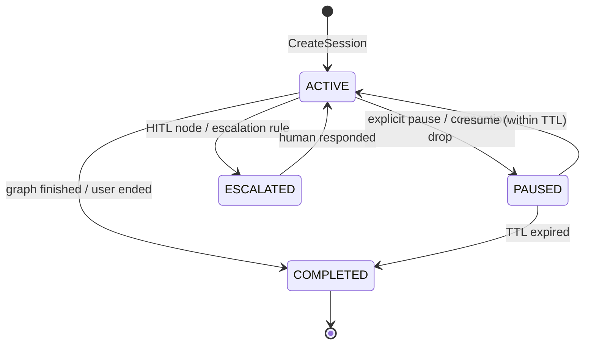

```python

class Persona:
    """Agent persona loaded from YAML + optional code registration."""
    name: str
    role: str
    description: str
    graph_template: GraphTemplate     # Default: REACT
    skills: list[str]
    tools: list[str]                  # Supports wildcards: "mcp_zendesk_*"
    escalation_rules: list[EscalationRule]
    model_config: ModelConfig
    capabilities: PersonaCapabilities
    slo_targets: SLOTargets | None
    graph_cls: type[BaseAgentGraph] | None = None  # Set by @agent_persona decorator

class Skill:
    """Mutable skill definition with version history for Auto Research optimization."""
    name: str
    instructions: str                 # The mutable prompt/instructions
    version: int
    score_history: list[float]        # Track improvement over iterations
    created_at: datetime
    updated_at: datetime

class Roadmap:
    """Multi-phase execution plan for GSD Sequencer."""
    title: str
    objectives: list[str]             # Measurable success criteria
    phases: list[Phase]

class Phase:
    name: str
    tasks: list[RoadmapTask]
    gate: GateCondition               # Must pass before advancing

class RoadmapTask:
    id: str
    description: str
    spec: str                         # Detailed task specification
    verification_criteria: list[str]  # How to verify completion
    depends_on: list[str]             # Task IDs this depends on

class EscalationRule:
    condition: str                    # Safe expression (see Section 10.3)
    target: str                       # Persona name or "human"
    priority: str = "normal"          # "normal" | "urgent"
```

### 5.2 Domain Events

| Event | Trigger | Handled via Port |
|-------|---------|------------------|
| `MessageProcessed` | After graph completes | `ObservabilityPort`, SLO tracking |
| `SessionCreated` | New session | `ObservabilityPort` |
| `SLOBreached` | SLI exceeds target | `AlertPort` |
| `SkillOptimized` | Auto Research improves a skill | `MemoryPort` (stores new version) |
| `HumanEscalationRequested` | Graph hits HITL node | Primary adapter (transport sends to client) |
| `ErrorBudgetExhausted` | Burn rate too high | `AlertPort` |
| `ToolDegraded` | Tool fails healthcheck or execution | `ToolPort` (deregisters), `AlertPort` |
| `ToolRecovered` | MCP server reconnects, tool re-passes healthcheck | `ToolPort` (re-registers) |

Note: Domain events reference Ports, never concrete adapters. The Composition Root wires concrete handlers.

### 5.3 Domain Services

**RoutingService**: Given a persona_id, resolves the graph template + tools + memory config.
**EscalationService**: Evaluates escalation rules from PersonaConfig, decides target (another persona or human).
**EvalScoring**: Applies BinaryEvalRules to batch results, produces aggregate scores.

### 5.4 Enums

```python
class EmbeddingTaskType(str, Enum):
    """Task-specific optimization for embedding generation.
    Providers that support task types (Gemini, Cohere) use these to optimize vectors."""
    SEMANTIC_SIMILARITY = "SEMANTIC_SIMILARITY"
    RETRIEVAL_QUERY = "RETRIEVAL_QUERY"
    RETRIEVAL_DOCUMENT = "RETRIEVAL_DOCUMENT"
    CODE_RETRIEVAL_QUERY = "CODE_RETRIEVAL_QUERY"
    CLASSIFICATION = "CLASSIFICATION"
    CLUSTERING = "CLUSTERING"
    QUESTION_ANSWERING = "QUESTION_ANSWERING"
    FACT_VERIFICATION = "FACT_VERIFICATION"

class SessionState(str, Enum):
    ACTIVE = "active"
    PAUSED = "paused"
    ESCALATED = "escalated"
    COMPLETED = "completed"

class GraphTemplate(str, Enum):
    REACT = "react"                    # Default
    PLAN_EXECUTE = "plan-and-execute"
    REFLEXION = "reflexion"
    LLM_COMPILER = "llm-compiler"
    SUPERVISOR = "supervisor"
    ORCHESTRATOR = "orchestrator"      # GSD + Superpowers + Auto Research
```

## 6. Application Layer

### 6.1 Ports

```python
class MemoryPort(ABC):
    """Short-term conversation memory."""
    @abstractmethod
    async def store_message(self, message: AgentMessage) -> None: ...
    @abstractmethod
    async def get_messages(self, session_id: str, limit: int = 50) -> list[AgentMessage]: ...
    @abstractmethod
    async def get_context_window(self, session_id: str, max_tokens: int) -> list[AgentMessage]: ...

class SessionPort(ABC):
    """Session CRUD + checkpoint persistence."""
    @abstractmethod
    async def create(self, session: Session) -> None: ...
    @abstractmethod
    async def get(self, session_id: str) -> Session | None: ...
    @abstractmethod
    async def update(self, session: Session) -> None: ...
    @abstractmethod
    async def store_checkpoint(self, session_id: str, checkpoint_data: bytes) -> str: ...
    @abstractmethod
    async def load_checkpoint(self, checkpoint_id: str) -> bytes: ...

class EmbeddingProviderPort(ABC):
    """Generate embeddings from content. Decoupled from storage.
    Supports multiple providers: Gemini Embedding, OpenAI, local models."""

    @abstractmethod
    async def embed_text(self, text: str, task_type: EmbeddingTaskType | None = None,
                         dimensions: int | None = None) -> list[float]:
        """Generate embedding for text. Dimensions configurable via Matryoshka."""

    @abstractmethod
    async def embed_batch(self, texts: list[str], task_type: EmbeddingTaskType | None = None,
                          dimensions: int | None = None) -> list[list[float]]:
        """Batch embedding generation for ingestion pipelines."""

    @abstractmethod
    async def embed_multimodal(self, content: MultimodalContent,
                                task_type: EmbeddingTaskType | None = None,
                                dimensions: int | None = None) -> list[float]:
        """Generate embedding from multimodal content (text + images + audio + video + PDF).
        Only supported by providers that handle multimodal input (e.g., Gemini Embedding)."""

    @property
    @abstractmethod
    def supported_modalities(self) -> list[str]:
        """Return list of supported modalities: ['text'], or ['text','image','audio','video','pdf']."""

    @property
    @abstractmethod
    def max_dimensions(self) -> int:
        """Maximum embedding dimensions this provider supports."""

    @property
    @abstractmethod
    def default_dimensions(self) -> int:
        """Default embedding dimensions."""

class EmbeddingStorePort(ABC):
    """Store and search over vector embeddings (pgvector). Provider-agnostic."""
    @abstractmethod
    async def store(self, embedding: list[float], metadata: dict) -> None: ...
    @abstractmethod
    async def search(self, query_embedding: list[float], top_k: int = 5) -> list[SearchResult]: ...
    @abstractmethod
    async def ensure_dimensions(self, dimensions: int) -> None:
        """Ensure the vector index supports the given dimensionality."""

class GraphStorePort(ABC):
    """Knowledge graph for entity relations."""
    @abstractmethod
    async def store_entity(self, entity: Entity, relations: list[Relation]) -> None: ...
    @abstractmethod
    async def query(self, cypher: str) -> list[dict]: ...

class ToolPort(ABC):
    """Execute tools by name. Implemented by MCPBridgeAdapter.

    DESIGN NOTE (OpenClaw issue #50131 mitigation): Tools MUST be validated at
    registration time, not just call time. The healthcheck_tool method performs
    a dry-run to verify the tool can execute in the current runtime context.
    Tools that fail healthcheck are NEVER registered — preventing "phantom tools"
    that are visible to the LLM but fail at execution time."""
    @abstractmethod
    async def execute(self, tool_name: str, args: dict) -> ToolResult: ...
    @abstractmethod
    async def list_tools(self, persona_id: str) -> list[ToolInfo]: ...
    @abstractmethod
    async def healthcheck_tool(self, tool_name: str) -> ToolHealthStatus: ...
    @abstractmethod
    async def deregister_tool(self, tool_name: str) -> None:
        """Dynamically remove a tool that has become unhealthy."""

class GraphOrchestrationPort(ABC):
    """Compile and execute LangGraph graphs. Implemented by LangGraphAdapter."""
    @abstractmethod
    async def compile_graph(self, graph: BaseAgentGraph, checkpoint_id: str | None) -> CompiledGraph: ...
    @abstractmethod
    async def stream_execution(self, compiled: CompiledGraph, input: dict) -> AsyncIterator[StreamEvent]: ...

class TracingPort(ABC):
    """Distributed tracing (spans). Implemented by OTelAdapter."""
    @abstractmethod
    def start_span(self, name: str, attributes: dict) -> Span: ...
    @abstractmethod
    def end_span(self, span: Span) -> None: ...

class MetricsPort(ABC):
    """Prometheus-style metrics. Implemented by OTelAdapter."""
    @abstractmethod
    def increment_counter(self, name: str, labels: dict, value: float = 1) -> None: ...
    @abstractmethod
    def observe_histogram(self, name: str, labels: dict, value: float) -> None: ...

class CostTrackingPort(ABC):
    """LLM cost tracking. Implemented by LangfuseAdapter."""
    @abstractmethod
    async def record_generation(self, model: str, input_tokens: int,
                                 output_tokens: int, metadata: dict) -> None: ...

class LoggingPort(ABC):
    """Structured logging with trace correlation. Implemented by StructlogAdapter."""
    @abstractmethod
    def bind_context(self, **kwargs: Any) -> None:
        """Bind contextual fields (trace_id, session_id) to current request scope."""
    @abstractmethod
    def log(self, level: str, event: str, **kwargs: Any) -> None: ...

class AlertPort(ABC):
    """Fire alerts to Prometheus Alertmanager."""
    @abstractmethod
    async def fire(self, severity: str, summary: str, details: dict) -> None: ...
```

| Port | Implemented by |
|------|----------------|
| `MemoryPort` | `RedisAdapter` |
| `SessionPort` | `PostgresAdapter` |
| `EmbeddingProviderPort` | `GeminiEmbeddingAdapter` (default) / `OpenAIEmbeddingAdapter` / `LocalEmbeddingAdapter` |
| `EmbeddingStorePort` | `PgVectorAdapter` |
| `GraphStorePort` | `FalkorDBAdapter` |
| `ToolPort` | `MCPBridgeAdapter` |
| `GraphOrchestrationPort` | `LangGraphAdapter` |
| `TracingPort` | `OTelAdapter` |
| `MetricsPort` | `OTelAdapter` |
| `CostTrackingPort` | `LangfuseAdapter` |
| `LoggingPort` | `StructlogAdapter` |
| `AlertPort` | `AlertManagerAdapter` |

Note: The former `ObservabilityPort` is split into `TracingPort`, `MetricsPort`, `CostTrackingPort`, and `LoggingPort` to avoid ambiguous multi-adapter composition. Each port has exactly one adapter. All signals correlate via `trace_id`.

### 6.2 Commands (side effects)

- **HandleMessage**: Receives message → routes to persona graph → streams response → publishes MessageProcessed
- **CreateSession**: Initializes session entity + checkpoint in PostgreSQL
- **ResumeHITL**: Loads checkpoint, injects human response, resumes graph execution
- **ExecuteRoadmap**: GSD Sequencer runs phases sequentially with isolated context
- **OptimizeSkill**: Auto Research loop — batch execute, eval, mutate, iterate

### 6.3 Queries (read-only)

- **GetSession**: Returns session state + metadata
- **ListPersonas**: Returns discovered persona configs
- **GetSLOStatus**: Returns current SLI values vs targets, error budget remaining

### 6.4 Middleware Chain

Composable, ASGI-inspired. Each middleware wraps the next:

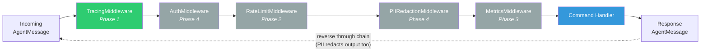

- **TracingMiddleware**: Creates OTel span, injects trace_id into AgentMessage
- **AuthMiddleware**: Validates JWT/API key, extracts user_id
- **RateLimitMiddleware**: Token bucket per session/user (Redis-backed)
- **PIIRedactionMiddleware**: Strips emails, phones, SSNs, credit cards from content
- **MetricsMiddleware**: Records request duration, token count, status

### 6.5 Application Services (Meta-Orchestration)

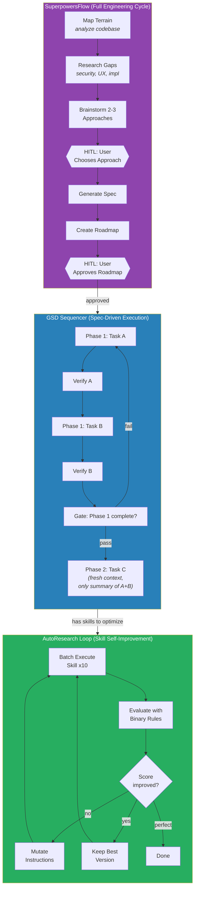

**GSDSequencer**: Spec-Driven Development. Breaks complex tasks into sub-agent executions with isolated context. Each task gets a fresh context with only a compressed summary of prior results.

**SuperpowersFlow**: Full engineering cycle — map terrain → research gaps → brainstorm 2-3 approaches → HITL choose → generate spec → create roadmap → HITL approve → delegate to GSD → final verification.

**AutoResearchLoop**: Skill self-improvement. Batch execute skill → evaluate with binary rules → mutate instructions → iterate until convergence or max iterations.

## 7. Primary Adapters

### 7.1 WebSocket Adapter

Based on `websockets` library. Features:
- Heartbeat: ping/pong every 30s
- Auto-reconnection hints: close code 1012
- Streaming: token-by-token for LLM responses
- Binary frames: ElevenLabs voice audio (base64)
- Session multiplexing: multiple personas per connection

Protocol:
```json
// Session lifecycle
→ { "type": "create_session", "persona_id": "...", "user_id": "..." }
← { "type": "session_created", "session_id": "..." }
→ { "type": "close_session", "session_id": "..." }
← { "type": "session_closed", "session_id": "..." }

// Messaging
→ { "type": "message", "session_id": "...", "persona_id": "...", "content": "..." }
← { "type": "stream_start", "session_id": "..." }
← { "type": "stream_token", "token": "..." }
← { "type": "stream_end" }

// Human-in-the-loop
← { "type": "human_escalation", "session_id": "...", "prompt": "..." }
→ { "type": "human_response", "session_id": "...", "content": "..." }

// Voice
← { "type": "audio", "session_id": "...", "data": "<base64>" }

// Errors
← { "type": "error", "session_id": "...", "code": "...", "message": "..." }
// Error codes: invalid_session, invalid_persona, rate_limited, auth_failed,
//              internal_error, session_limit_exceeded
```

Connection drop behavior: All active sessions for the connection transition to `PAUSED` state. Checkpoints are persisted. Sessions are resumable within a configurable TTL (default 30 minutes). Max concurrent sessions per connection: configurable, default 10.

### 7.2 gRPC Adapter

```protobuf
service AgentService {
  rpc SendMessage(AgentRequest) returns (stream AgentResponse);
  rpc CreateSession(CreateSessionRequest) returns (SessionInfo);
  rpc GetSession(GetSessionRequest) returns (SessionInfo);
  rpc ResumeHITL(HumanResponse) returns (stream AgentResponse);
  rpc ListPersonas(Empty) returns (PersonaList);
  rpc HealthCheck(Empty) returns (HealthStatus);
}

message HumanResponse {
  string session_id = 1;
  string content = 2;
}

message AgentResponse {
  oneof payload {
    StreamToken token = 1;
    StreamEnd end = 2;
    HumanEscalation escalation = 3;
    AudioChunk audio = 4;
    ErrorDetail error = 5;
  }
}
```

## 8. Secondary Adapters

### 8.1 Memory Adapters

- **RedisAdapter** → implements `MemoryPort`: conversation cache, session hot state, pub/sub
- **PostgresAdapter** → implements `SessionPort`: sessions, checkpoints, audit log
- **PgVectorAdapter** → implements `EmbeddingStorePort`: vector storage + similarity search in pgvector
- **FalkorDBAdapter** → implements `GraphStorePort`: knowledge graph, entity relations

### 8.2 Embedding Providers

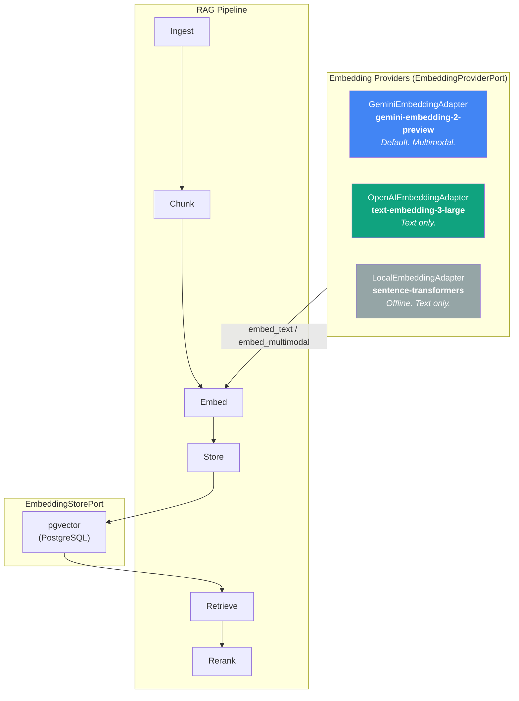

#### GeminiEmbeddingAdapter (Default)

```python
class GeminiEmbeddingAdapter(EmbeddingProviderPort):
    """Gemini Embedding 2 — natively multimodal embeddings.
    Maps text, images, video, audio, and PDFs into a unified vector space."""

    # Model: gemini-embedding-2-preview
    # Dimensions: 128 to 3072 (Matryoshka), default 3072
    # Max input: 8192 tokens across all modalities
    # Languages: 100+
    # Task types: all EmbeddingTaskType variants supported

    def __init__(self, settings: EmbeddingProviderSettings):
        self._client = genai.Client(api_key=settings.gemini_api_key)
        self._model = settings.gemini_embedding_model  # "gemini-embedding-2-preview"
        self._default_dimensions = settings.embedding_dimensions  # 768 recommended for cost/quality

    async def embed_text(self, text: str, task_type: EmbeddingTaskType | None = None,
                         dimensions: int | None = None) -> list[float]:
        result = await self._client.models.embed_content(
            model=self._model,
            contents=text,
            config=EmbedContentConfig(
                task_type=task_type.value if task_type else "RETRIEVAL_DOCUMENT",
                output_dimensionality=dimensions or self._default_dimensions,
            ),
        )
        return result.embeddings[0].values

    async def embed_multimodal(self, content: MultimodalContent,
                                task_type: EmbeddingTaskType | None = None,
                                dimensions: int | None = None) -> list[float]:
        """Embed mixed content: text + images + audio + video + PDF.
        All modalities map to the SAME vector space — enabling cross-modal search."""
        parts = self._build_parts(content)  # Convert to Gemini Part objects
        result = await self._client.models.embed_content(
            model=self._model,
            contents=parts,
            config=EmbedContentConfig(
                task_type=task_type.value if task_type else "RETRIEVAL_DOCUMENT",
                output_dimensionality=dimensions or self._default_dimensions,
            ),
        )
        return result.embeddings[0].values

    @property
    def supported_modalities(self) -> list[str]:
        return ["text", "image", "audio", "video", "pdf"]

    @property
    def max_dimensions(self) -> int:
        return 3072

    @property
    def default_dimensions(self) -> int:
        return self._default_dimensions
```

#### Matryoshka Dimension Strategy

Gemini Embedding uses Matryoshka Representation Learning — the first N dimensions of a 3072-d vector are a valid N-dimensional embedding. This enables:

| Dimensions | Use case | Storage per 1M vectors | Quality |
|-----------|---------|----------------------|---------|
| 3072 | Maximum quality (benchmarks, offline analysis) | ~11.5 GB | Best |
| 1536 | Balanced (production RAG) | ~5.8 GB | Very good |
| 768 | **Recommended default** (cost/quality sweet spot) | ~2.9 GB | Good |
| 256 | Lightweight (mobile, edge, high-volume filtering) | ~0.97 GB | Acceptable |
| 128 | Ultra-compact (pre-filtering, clustering) | ~0.49 GB | Minimum viable |

The library defaults to **768 dimensions** for production use. Consumers can override per persona in YAML:

```yaml
# agents/research-agent.yaml
embedding_config:
  provider: gemini          # gemini | openai | local
  model: gemini-embedding-2-preview
  dimensions: 1536          # Override: higher quality for research tasks
  task_type: RETRIEVAL_DOCUMENT
```

#### MultimodalContent Value Object

```python
class MultimodalContent(BaseModel):
    """Content that can contain multiple modalities for embedding."""
    text: str | None = None
    images: list[bytes] = []          # PNG/JPEG, max 6 per request
    audio: bytes | None = None        # MP3/WAV, max 80 seconds
    video: bytes | None = None        # MP4/MOV, max 120 seconds
    pdf: bytes | None = None          # Max 6 pages
```

#### RAG Pipeline (modular)

```python
class RAGPipeline:
    """Configurable pipeline: ingest -> chunk -> embed -> store -> retrieve -> rerank.
    Provider-agnostic: works with any EmbeddingProviderPort implementation."""

    def __init__(self, embedding_provider: EmbeddingProviderPort,
                 embedding_store: EmbeddingStorePort):
        self._provider = embedding_provider
        self._store = embedding_store

    async def ingest(self, documents: list[Document],
                     task_type: EmbeddingTaskType = EmbeddingTaskType.RETRIEVAL_DOCUMENT) -> int:
        """Chunk documents -> generate embeddings -> store in pgvector.
        Returns number of chunks stored."""
        chunks = self._chunk(documents)
        embeddings = await self._provider.embed_batch(
            [c.text for c in chunks], task_type=task_type
        )
        for chunk, embedding in zip(chunks, embeddings):
            await self._store.store(embedding, metadata=chunk.metadata)
        return len(chunks)

    async def retrieve(self, query: str, top_k: int = 5,
                       task_type: EmbeddingTaskType = EmbeddingTaskType.RETRIEVAL_QUERY) -> list[RetrievedChunk]:
        """Embed query -> search pgvector -> return ranked chunks."""
        query_embedding = await self._provider.embed_text(query, task_type=task_type)
        return await self._store.search(query_embedding, top_k=top_k)

    async def retrieve_multimodal(self, content: MultimodalContent,
                                   top_k: int = 5) -> list[RetrievedChunk]:
        """Cross-modal search: query with image/audio/video, find text (or vice versa).
        Only works with multimodal providers (Gemini Embedding)."""
        if "image" not in self._provider.supported_modalities:
            raise UnsupportedModalityError(f"Provider does not support multimodal search")
        query_embedding = await self._provider.embed_multimodal(content)
        return await self._store.search(query_embedding, top_k=top_k)
```

#### Cross-Modal Search Example

Because Gemini Embedding maps all modalities to the same vector space:

```python
# Ingest a product catalog with images
await rag.ingest([
    Document(text="Red running shoes, Nike Air Max", image=shoe_image_bytes),
    Document(text="Blue denim jacket, Levi's", image=jacket_image_bytes),
])

# Query with text → finds matching images
results = await rag.retrieve("comfortable running shoes")

# Query with image → finds matching text descriptions
results = await rag.retrieve_multimodal(MultimodalContent(images=[photo_of_shoes]))

# Query with audio → finds matching documents (voice search)
results = await rag.retrieve_multimodal(MultimodalContent(audio=voice_query_bytes))
```

#### Embedding Provider Configuration

```python
class EmbeddingProviderSettings(BaseModel):
    provider: Literal["gemini", "openai", "local"] = "gemini"
    gemini_api_key: str | None = None
    gemini_embedding_model: str = "gemini-embedding-2-preview"
    openai_api_key: str | None = None
    openai_embedding_model: str = "text-embedding-3-large"
    local_model_name: str = "all-MiniLM-L6-v2"  # sentence-transformers
    embedding_dimensions: int = 768               # Matryoshka default
```

#### Provider Incompatibility Warning

Embedding spaces between different providers (and even different model versions within the same provider) are **incompatible**. Switching providers or upgrading model versions requires re-embedding all stored vectors. The RAG pipeline logs a `WARNING` if the configured provider differs from the one that generated stored vectors (tracked in embedding metadata).

### 8.3 Tool Adapters

- **MCPBridgeAdapter** → implements `ToolPort`: discovers MCP servers (stdio/SSE/streamable-http), registers tools with `mcp_{server}_{tool}` naming, safe env resolution, error sanitization
- **LangGraphAdapter** → implements `GraphOrchestrationPort`: graph compilation, checkpoint management, graph template instantiation, streaming execution

### 8.4 Tool Health & Phantom Tool Prevention

Lesson learned from OpenClaw issue #50131: tools that are visible to the LLM but fail at runtime cause hallucinated responses and silent failures. agentic-core prevents this with a **three-layer defense**:

**Layer 1 — Registration-time healthcheck:**
When `MCPBridgeAdapter.start()` discovers tools from MCP servers, each tool undergoes a dry-run healthcheck before registration. Tools that fail are logged as warnings and excluded from `list_tools()` — the LLM never sees them.

**Layer 2 — Single runtime context:**
Unlike OpenClaw's dual loading paths (gateway vs chat/agent), `AgentRuntime` is the single Composition Root. The `ToolPort` instance injected into command handlers is always the same object with the same runtime capabilities, regardless of which transport (WebSocket or gRPC) originated the request.

**Layer 3 — Runtime degradation handling:**
If a previously healthy tool fails at execution time (e.g., MCP server disconnected), the adapter:
1. Returns `ToolResult(success=False, error=ToolError(code="capability_missing", retriable=False))`
2. Publishes `ToolDegraded` domain event
3. Dynamically deregisters the tool via `deregister_tool()`
4. On MCP server reconnection, re-runs healthcheck and re-registers if healthy

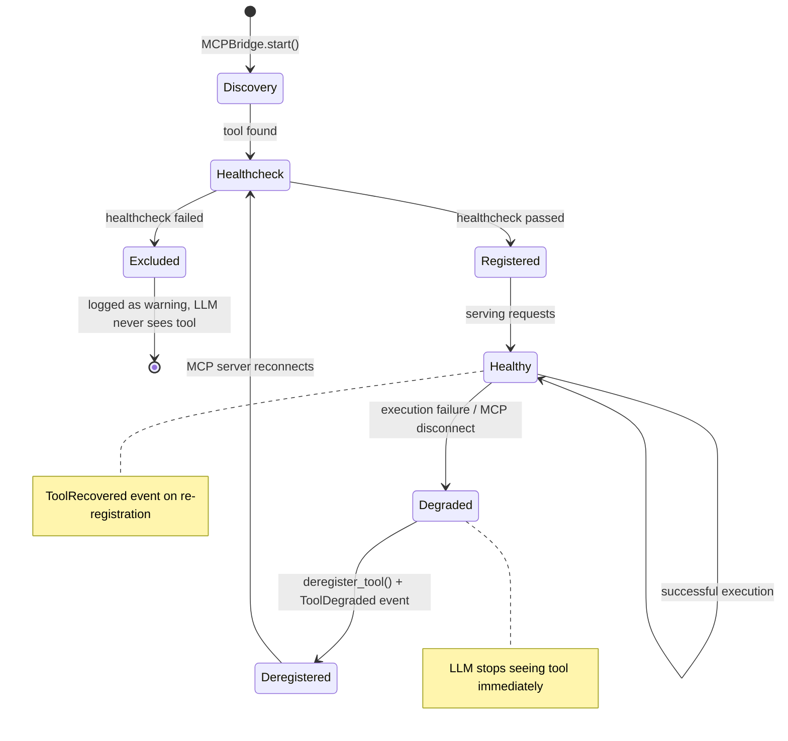

```python
class ToolHealthStatus(BaseModel):
    tool_name: str
    healthy: bool
    reason: str | None = None        # Why unhealthy

class ToolResult(BaseModel):
    success: bool
    output: str | None = None
    error: ToolError | None = None

class ToolError(BaseModel):
    code: Literal["not_found", "execution_failed", "capability_missing", "timeout"]
    message: str
    retriable: bool
```

### 8.3 Observability Stack

The observability stack follows the **three pillars** (metrics, traces, logs) plus cost tracking and alerting. All signals are correlated via `trace_id`.

#### 8.3.1 Stack Architecture

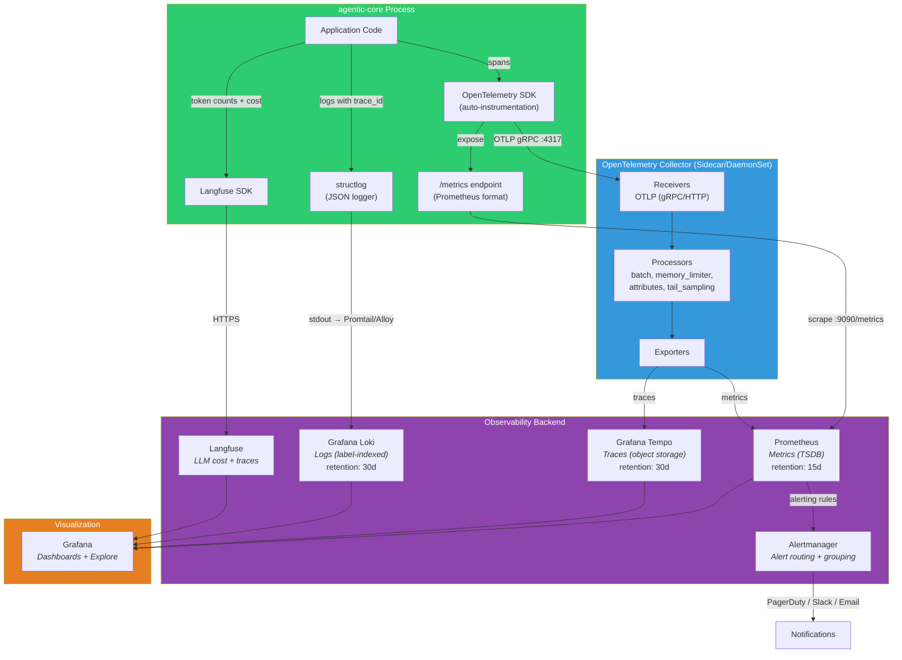

#### 8.3.2 Signal Correlation

All three pillars are correlated via `trace_id` enabling seamless drill-down in Grafana:

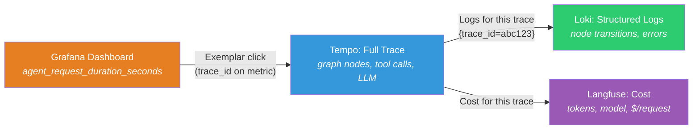

#### 8.3.3 Adapters

**OTelAdapter** → implements `TracingPort` + `MetricsPort`

```python
class OTelAdapter(TracingPort, MetricsPort):
    """Configures OpenTelemetry SDK with OTLP exporter + Prometheus metrics."""

    def __init__(self, settings: AgenticSettings):
        # Tracer provider → OTLP exporter → OTel Collector → Tempo
        self._tracer_provider = TracerProvider(
            resource=Resource.create({
                "service.name": "agentic-core",
                "service.version": settings.version,
                "deployment.environment": settings.environment,
            }),
            sampler=TraceIdRatioBased(settings.otel_sample_rate),  # default 1.0
        )
        self._tracer_provider.add_span_processor(
            BatchSpanProcessor(OTLPSpanExporter(endpoint=settings.otel_endpoint))
        )

        # Meter provider → Prometheus exporter → scraped by Prometheus
        self._meter_provider = MeterProvider(
            resource=self._tracer_provider.resource,
            metric_readers=[PrometheusMetricReader()],
        )

    # TracingPort implementation
    def start_span(self, name: str, attributes: dict) -> Span:
        return self._tracer.start_span(name, attributes=attributes)

    # MetricsPort implementation — pre-defined agent metrics
    def _register_metrics(self):
        meter = self._meter_provider.get_meter("agentic_core")

        self.request_duration = meter.create_histogram(
            "agent_request_duration_seconds",
            description="Agent request latency",
            unit="s",
        )
        self.requests_total = meter.create_counter(
            "agent_requests_total",
            description="Total agent requests",
        )
        self.tokens_total = meter.create_counter(
            "agent_tokens_total",
            description="Total LLM tokens consumed",
        )
        self.active_sessions = meter.create_up_down_counter(
            "agent_active_sessions",
            description="Currently active sessions",
        )
        self.errors_total = meter.create_counter(
            "agent_errors_total",
            description="Total agent errors",
        )
        self.tool_executions = meter.create_histogram(
            "agent_tool_execution_seconds",
            description="Tool execution latency",
            unit="s",
        )
        self.memory_operations = meter.create_counter(
            "agent_memory_operations_total",
            description="Memory store operations",
        )
        self.error_budget_remaining = meter.create_observable_gauge(
            "agent_error_budget_remaining_ratio",
            description="Remaining error budget (0.0-1.0)",
            callbacks=[self._observe_error_budget],
        )
```

**Pre-defined Prometheus metrics:**

| Metric | Type | Labels | Purpose |
|--------|------|--------|---------|
| `agent_request_duration_seconds` | Histogram | `persona_id`, `status`, `graph_template` | Latency SLI (p50, p95, p99) |
| `agent_requests_total` | Counter | `persona_id`, `status`, `transport` | Throughput + success rate SLI |
| `agent_tokens_total` | Counter | `persona_id`, `model`, `direction` | Token consumption for FinOps |
| `agent_active_sessions` | UpDownCounter | `persona_id` | Concurrency monitoring |
| `agent_errors_total` | Counter | `persona_id`, `error_type` | Error rate SLI |
| `agent_tool_execution_seconds` | Histogram | `tool_name`, `source` | Tool latency monitoring |
| `agent_memory_operations_total` | Counter | `store`, `operation` | Memory store health |
| `agent_error_budget_remaining_ratio` | Gauge | `persona_id`, `sli_name` | SLO compliance |
| `agent_hitl_escalations_total` | Counter | `persona_id`, `reason` | Human escalation tracking |
| `agent_mcp_server_status` | Gauge | `server_name`, `status` | MCP server health (1=up, 0=down) |

**LangfuseAdapter** → implements `CostTrackingPort`

```python
class LangfuseAdapter(CostTrackingPort):
    """Langfuse integration for LLM cost tracking + generation tracing."""

    async def record_generation(self, model: str, input_tokens: int,
                                 output_tokens: int, metadata: dict) -> None:
        self._langfuse.generation(
            name=metadata.get("node_name", "llm_call"),
            model=model,
            usage={"input": input_tokens, "output": output_tokens},
            metadata={
                "persona_id": metadata["persona_id"],
                "session_id": metadata["session_id"],
                "trace_id": metadata.get("trace_id"),  # Correlate with OTel
            },
        )
```

**AlertManagerAdapter** → implements `AlertPort`

```python
class AlertManagerAdapter(AlertPort):
    """Pushes alerts to Prometheus Alertmanager via HTTP API."""

    async def fire(self, severity: str, summary: str, details: dict) -> None:
        await self._http_client.post(
            f"{self._alertmanager_url}/api/v2/alerts",
            json=[{
                "labels": {
                    "alertname": details.get("alert_name", "AgenticCoreAlert"),
                    "severity": severity,       # "critical" | "warning"
                    "persona_id": details.get("persona_id", "unknown"),
                    "service": "agentic-core",
                },
                "annotations": {
                    "summary": summary,
                    "description": details.get("description", ""),
                    "runbook_url": details.get("runbook_url", ""),
                },
            }],
        )
```

#### 8.3.4 Alerting Rules (deployed as PrometheusRule CRD)

```yaml
# deployment/helm/agentic-core/templates/prometheusrule.yaml
groups:
  - name: agentic-core.rules
    rules:
      # High error rate
      - alert: AgentHighErrorRate
        expr: |
          sum(rate(agent_errors_total[5m])) by (persona_id)
          / sum(rate(agent_requests_total[5m])) by (persona_id)
          > 0.05
        for: 5m
        labels:
          severity: critical
        annotations:
          summary: "Agent {{ $labels.persona_id }} error rate > 5%"
          runbook_url: "https://docs.example.com/runbooks/agent-high-error-rate"

      # High latency (p99)
      - alert: AgentHighLatencyP99
        expr: |
          histogram_quantile(0.99,
            sum(rate(agent_request_duration_seconds_bucket[5m])) by (le, persona_id)
          ) > 5
        for: 10m
        labels:
          severity: warning
        annotations:
          summary: "Agent {{ $labels.persona_id }} p99 latency > 5s"

      # Error budget burn rate (SLO)
      - alert: AgentErrorBudgetBurnRate
        expr: agent_error_budget_remaining_ratio < 0.25
        for: 5m
        labels:
          severity: critical
        annotations:
          summary: "Agent {{ $labels.persona_id }} error budget < 25% remaining"

      # MCP server down
      - alert: MCPServerDown
        expr: agent_mcp_server_status == 0
        for: 2m
        labels:
          severity: warning
        annotations:
          summary: "MCP server {{ $labels.server_name }} is down"

      # Session count spike (possible abuse)
      - alert: AgentSessionSpike
        expr: |
          agent_active_sessions > 500
        for: 5m
        labels:
          severity: warning
        annotations:
          summary: "Active sessions > 500, possible abuse or leak"

      # HITL escalation rate too high
      - alert: AgentHighEscalationRate
        expr: |
          sum(rate(agent_hitl_escalations_total[15m])) by (persona_id)
          / sum(rate(agent_requests_total[15m])) by (persona_id)
          > 0.3
        for: 15m
        labels:
          severity: warning
        annotations:
          summary: "Agent {{ $labels.persona_id }} escalation rate > 30%"
```

#### 8.3.5 OpenTelemetry Collector Configuration

```yaml
# deployment/helm/agentic-core/templates/otel-collector-config.yaml
receivers:
  otlp:
    protocols:
      grpc:
        endpoint: 0.0.0.0:4317
      http:
        endpoint: 0.0.0.0:4318

processors:
  batch:
    timeout: 5s
    send_batch_size: 1024
  memory_limiter:
    check_interval: 1s
    limit_mib: 512
    spike_limit_mib: 128
  attributes:
    actions:
      - key: deployment.environment
        action: upsert
        from_attribute: AGENTIC_ENVIRONMENT
  tail_sampling:
    decision_wait: 10s
    policies:
      - name: errors-always
        type: status_code
        status_code: { status_codes: [ERROR] }
      - name: slow-traces
        type: latency
        latency: { threshold_ms: 5000 }
      - name: probabilistic
        type: probabilistic
        probabilistic: { sampling_percentage: 10 }

exporters:
  otlp/tempo:
    endpoint: tempo.observability.svc:4317
    tls:
      insecure: true
  prometheus:
    endpoint: 0.0.0.0:8889

service:
  pipelines:
    traces:
      receivers: [otlp]
      processors: [memory_limiter, tail_sampling, batch]
      exporters: [otlp/tempo]
    metrics:
      receivers: [otlp]
      processors: [memory_limiter, batch]
      exporters: [prometheus]
```

#### 8.3.6 Grafana Dashboards

The library ships with pre-built Grafana dashboard JSON models in `deployment/grafana/`:

| Dashboard | Panels | Data Sources |
|-----------|--------|-------------|
| **Agent Overview** | Request rate, error rate, latency heatmap, active sessions, top personas | Prometheus |
| **Agent Deep Dive** | Per-persona latency, tool execution breakdown, token consumption, HITL rate | Prometheus |
| **Trace Explorer** | Service map, trace waterfall, span details | Tempo |
| **Log Explorer** | Log volume by level, error log stream, search by trace_id | Loki |
| **SLO Compliance** | Error budget burn, SLI trends, SLO status per persona | Prometheus |
| **LLM Cost** | Cost per persona, cost per model, daily/weekly trends, token distribution | Langfuse (via JSON API datasource) |
| **MCP Health** | Server status, tool registry changes, reconnection events | Prometheus + Loki |

#### 8.3.7 Logging Pipeline (structlog → Loki)

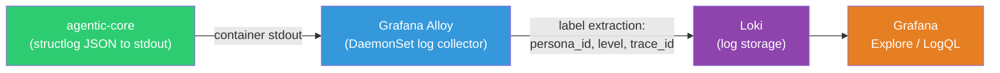

```python
# structlog configuration in runtime.py
import structlog

def configure_logging(settings: AgenticSettings):
    structlog.configure(
        processors=[
            structlog.contextvars.merge_contextvars,      # trace_id, session_id auto-injected
            structlog.processors.add_log_level,
            structlog.processors.TimeStamper(fmt="iso"),
            structlog.processors.StackInfoRenderer(),
            # Production: JSON for Loki ingestion
            # Development: console-colored for readability
            structlog.dev.ConsoleRenderer() if settings.log_format == "console"
            else structlog.processors.JSONRenderer(),
        ],
        logger_factory=structlog.PrintLoggerFactory(),
    )
```

Log output example (JSON, ingested by Loki):
```json
{
  "event": "graph_node_completed",
  "level": "info",
  "timestamp": "2026-03-25T14:30:00.123Z",
  "trace_id": "abc123def456",
  "session_id": "sess_789",
  "persona_id": "support-agent",
  "node_name": "action_node",
  "duration_ms": 1234,
  "tool_calls": 2
}
```

Grafana Alloy (or Promtail) extracts labels from JSON fields for efficient LogQL queries:
```logql
{service="agentic-core", persona_id="support-agent"} | json | level="error"
{service="agentic-core"} | json | trace_id="abc123def456"
sum(rate({service="agentic-core"} | json | level="error" [5m])) by (persona_id)
```

#### 8.3.8 Configuration Extensions

```python
# Added to AgenticSettings
class ObservabilitySettings(BaseModel):
    otel_endpoint: str = "http://otel-collector:4317"
    otel_sample_rate: float = 1.0          # 1.0 = sample everything, 0.1 = 10%
    otel_export_protocol: Literal["grpc", "http"] = "grpc"
    prometheus_port: int = 9090            # /metrics endpoint port
    langfuse_host: str = "https://cloud.langfuse.com"
    langfuse_public_key: str | None = None
    langfuse_secret_key: str | None = None
    alertmanager_url: str | None = None    # http://alertmanager:9093
    log_format: Literal["json", "console"] = "json"
    log_level: Literal["DEBUG", "INFO", "WARNING", "ERROR"] = "INFO"
```

## 9. Graph Templates

Selectable via `graph_template` field in persona YAML. Default: `react`.

| Template | Use case | Pattern |
|----------|---------|---------|
| `react` | Simple Q&A with tools (80% of cases) | Thought → Action → Observation → loop |
| `plan-and-execute` | Multi-step complex tasks | Plan → Execute each → Replan |
| `reflexion` | Quality-critical outputs | Act → Self-critique → Retry |
| `llm-compiler` | High throughput, independent tools | Plan DAG → Parallel execution |
| `supervisor` | Multi-persona collaboration | Supervisor routes to specialists |
| `orchestrator` | Full GSD + Superpowers + Auto Research | Meta-orchestration pattern |

Building block nodes (reusable across templates): `PlannerNode`, `ReflectorNode`, `ActorNode`, `HITLNode`, `RouterNode`.

Consumer can use templates OR build fully custom graphs by extending `BaseAgentGraph`.

#### Graph Template Topologies

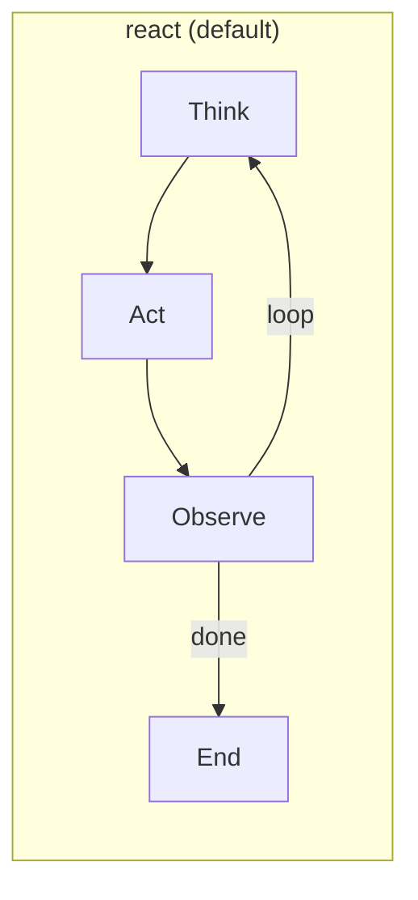

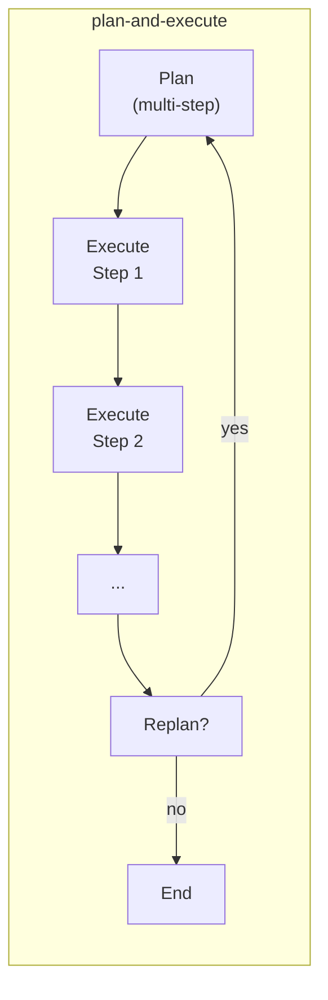

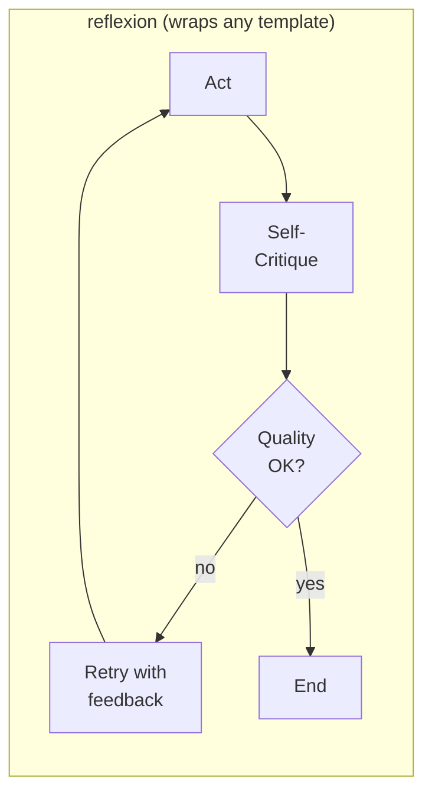

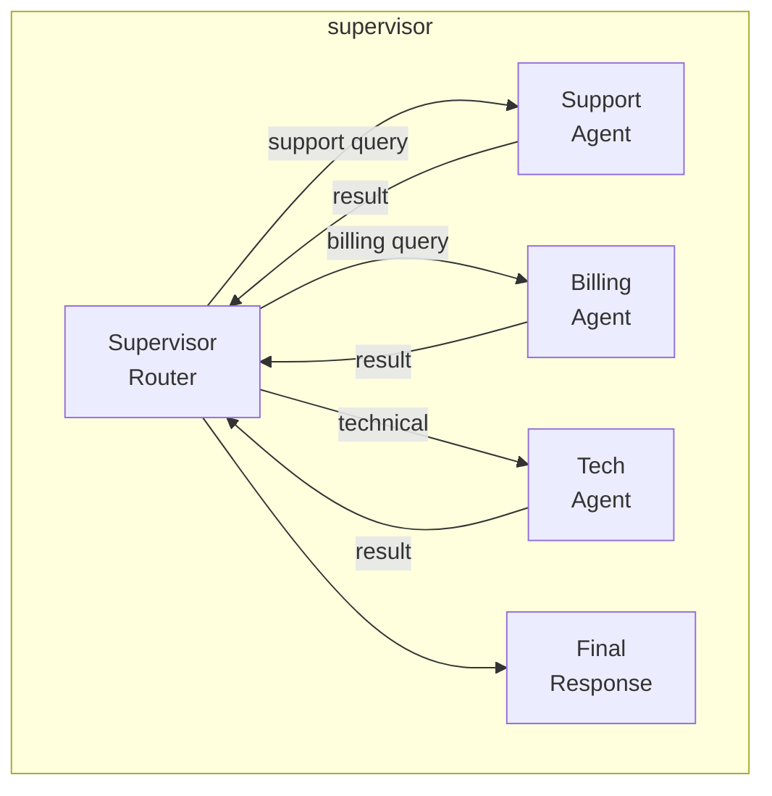

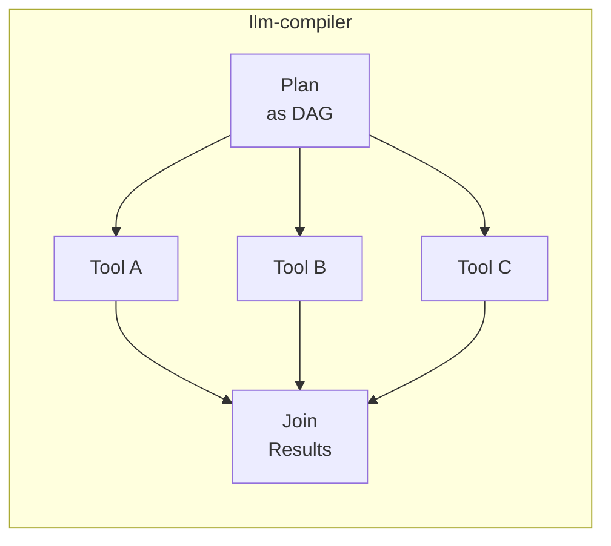

### 9.1 Decision Tree (for AGENTS.md)

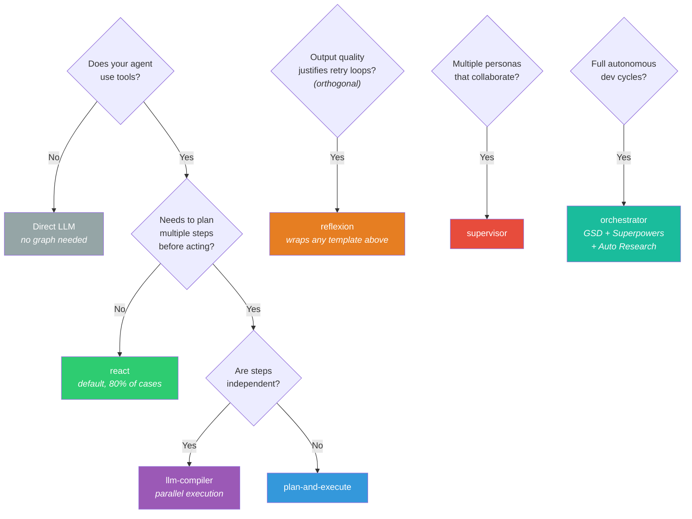

Note: `reflexion` is an orthogonal concern — it can wrap any base template to add self-critique. For example, `plan-and-execute` + `reflexion` means each execution step gets a self-critique pass before proceeding.

## 10. Persona System (Hybrid YAML + Code)

### 10.1 YAML Definition (edited by PM/Product)

```yaml
name: support-agent
role: "Customer support specialist"
description: "Handles customer inquiries"
graph_template: react
skills:
  - knowledge-base-search
  - ticket-creation
tools:
  - mcp_zendesk_*
  - rag_search
  - escalate_to_human
escalation_rules:
  - condition: "billing_amount > 500"
    target: "billing-agent"
  - condition: "sentiment < -0.7"
    target: "human"
    priority: "urgent"
model_config:
  provider: "anthropic"
  model: "claude-sonnet-4-6"
  temperature: 0.3
capabilities:
  gsd_enabled: false
  superpowers_flow: false
  auto_research: false
slo_targets:
  latency_p99_ms: 5000
  success_rate: 0.995
```

### 10.2 Code Registration (by engineer)

```python
@agent_persona("support-agent")
class SupportGraph(BaseAgentGraph):
    def build_graph(self) -> StateGraph:
        # Custom graph logic — overrides graph_template from YAML
        ...
```

When a code class is registered for a persona, it overrides the YAML `graph_template`. When no class is registered, the YAML template is used.

### 10.3 Escalation Rule Evaluation

Escalation rule conditions (e.g., `"billing_amount > 500"`) are evaluated using a **safe restricted expression evaluator** (`simpleeval` library) that disallows imports, attribute access, and arbitrary function calls. Python's built-in code execution is NEVER used for condition evaluation.

Available context variables in the condition:
- `sentiment`: float (-1.0 to 1.0, from latest message analysis)
- `message_count`: int (messages in current session)
- `billing_amount`: float (if available from session metadata)
- `error_count`: int (consecutive errors in current session)
- `duration_minutes`: float (session duration)
- Custom variables from `session.metadata`

Allowed operators: `>`, `<`, `>=`, `<=`, `==`, `!=`, `and`, `or`, `not`, `in`.

## 11. Configuration

```python
class AgenticSettings(BaseSettings):
    mode: Literal["sidecar", "standalone"] = "standalone"
    ws_host: str = "0.0.0.0"
    ws_port: int = 8765
    grpc_host: str = "0.0.0.0"     # sidecar → forced to 127.0.0.1
    grpc_port: int = 50051
    redis_url: str
    postgres_dsn: str
    falkordb_url: str
    otel_endpoint: str | None = None
    langfuse_public_key: str | None = None
    langfuse_secret_key: str | None = None
    rate_limit_rpm: int = 60
    pii_redaction_enabled: bool = True
    personas_dir: str = "agents/"
    mcp: MCPBridgeConfig = MCPBridgeConfig()
    model_config = SettingsConfigDict(env_prefix="AGENTIC_")

class MCPServerEntry(BaseModel):
    transport: Literal["stdio", "sse", "streamable-http"]
    command: str | None = None          # stdio
    args: list[str] = []                # stdio
    url: str | None = None              # sse / streamable-http
    headers: dict[str, str] = {}        # sse / streamable-http
    env: dict[str, str] = {}            # ${VAR} syntax, safe-resolved
    description: str = ""
    keywords: list[str] = []

class MCPBridgeConfig(BaseModel):
    mode: Literal["direct", "router"] = "direct"
    servers: dict[str, MCPServerEntry] = {}
    tool_prefix: bool = True
    reconnect_interval_ms: int = 30_000
    connection_timeout_ms: int = 10_000
    request_timeout_ms: int = 60_000
```

Sidecar mode forces `ws_host` and `grpc_host` to `127.0.0.1`.

## 12. Deployment

### 12.1 Modes

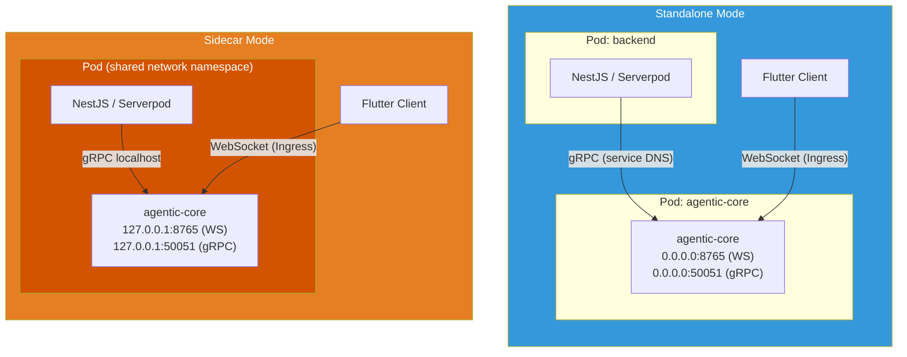

- **Standalone**: Own Deployment/StatefulSet. Scales independently. Binds 0.0.0.0.
- **Sidecar**: Container in same Pod as backend. Binds 127.0.0.1. Shares Pod network.

Helm chart supports both via `values.yaml` / `values-sidecar.yaml`.

### 12.2 CI/CD

- **ci.yaml**: ruff lint → mypy type check → pytest (unit only in Phase 1; integration from Phase 2 via `docker-compose.test.yaml` with Redis, PostgreSQL, FalkorDB) → trivy security scan. Coverage threshold: 80% minimum.
- **cd.yaml**: Docker multi-stage build → push to registry (on main merge)
- **release.yaml**: Semantic versioning → PyPI publish (on tag)

### 12.3 Logging Strategy (Quick Reference)

`structlog` is the standard logger, configured as a bound logger per-request with automatic context injection:

```python
log = structlog.get_logger().bind(
    trace_id=message.trace_id,
    session_id=message.session_id,
    persona_id=message.persona_id,
)
```

Log levels:
- `DEBUG`: Graph node transitions, tool call details (disabled in production)
- `INFO`: Session created/completed, message processed, persona loaded
- `WARNING`: HITL escalation, SLO approaching threshold, MCP reconnection
- `ERROR`: Graph execution failure, adapter connection lost, invalid input rejected

Output: JSON in production (Loki ingestion), console-colored in dev. See Section 8.3.7 for full pipeline details.

### 12.4 GitOps

```mermaid
graph LR
    DEV["Developer"] -->|"git push"| GH["GitHub<br/>(main branch)"]
    GH -->|"trigger"| CI["CI: lint + type<br/>+ test + scan"]
    CI -->|"pass"| CD["CD: Docker build<br/>+ push to registry"]
    CD -->|"update image tag in"| GITOPS["GitOps Repo<br/>(k8s manifests)"]
    GITOPS -->|"ArgoCD detects change"| DEV_C["Dev Cluster<br/><i>auto-sync</i>"]
    DEV_C -->|"manual approval"| STG["Staging Cluster"]
    STG -->|"manual approval"| PROD["Production Cluster"]

    style CI fill:#F39C12,color:#fff
    style CD fill:#3498DB,color:#fff
    style DEV_C fill:#2ECC71,color:#fff
    style STG fill:#E67E22,color:#fff
    style PROD fill:#E74C3C,color:#fff
```

ArgoCD Application with app-of-apps pattern. Kustomize overlays for dev/staging/production. Environment promotion via manual sync gates.

## 13. Implementation Phases

```mermaid
gantt
    title agentic-core Implementation Phases
    dateFormat YYYY-MM-DD
    axisFormat %b %d

    section Phase 1: Core
    shared_kernel (types, events)           :p1a, 2026-03-26, 2d
    domain layer (entities, VOs, events)    :p1b, after p1a, 3d
    application layer (ports, cmd/qry)      :p1c, after p1b, 3d
    primary adapters (WS + gRPC)            :p1d, after p1c, 4d
    config + runtime + proto                :p1e, after p1d, 2d
    pyproject.toml + CI                     :p1f, after p1e, 1d

    section Phase 2: Memory + RAG
    secondary adapters (Redis, PG, etc.)    :p2a, after p1f, 5d
    graph templates + building blocks       :p2b, after p2a, 5d
    RAG pipeline + MCP bridge               :p2c, after p2b, 4d
    persona discovery + registry            :p2d, after p2c, 2d

    section Phase 3: Observability + SRE
    OTel + Langfuse adapters                :p3a, after p2d, 3d
    SLO tracker + chaos hooks               :p3b, after p3a, 3d
    Meta-orchestration (GSD, Auto Research) :p3c, after p3b, 5d

    section Phase 4: Security + Deploy
    Auth, RateLimit, PII middleware          :p4a, after p3c, 3d
    Helm + ArgoCD + Terraform               :p4b, after p4a, 4d
    Dockerfile + GH Actions                 :p4c, after p4b, 2d
    README, AGENTS.md, SLO.md, examples     :p4d, after p4c, 3d
```

### Phase 1 (this spec): Core + Transport + Runtime
- shared_kernel (types, events)
- domain layer (entities, value objects, events, services, enums)
- application layer (ports ABCs, command/query handler skeletons, middleware base ABC + chain builder only)
- primary adapters (WebSocket + gRPC)
- config + runtime composition root
- proto definitions
- pyproject.toml + CI (unit tests only; integration tests require Phase 2 infra)

**Middleware note:** Phase 1 delivers only `base.py` (Middleware ABC + chain builder) and `tracing.py` (with a no-op fallback when OTel is absent). Concrete middleware implementations are mapped to their dependency phases:
- `TracingMiddleware` → Phase 1 (no-op fallback) + Phase 3 (OTel wired)
- `RateLimitMiddleware` → Phase 2 (requires Redis)
- `AuthMiddleware` → Phase 4 (requires PyJWT)
- `PIIRedactionMiddleware` → Phase 4 (requires presidio)
- `MetricsMiddleware` → Phase 3 (requires OTel)

### Phase 2: Memory + RAG + LangGraph
- secondary adapters (Redis, PostgreSQL, pgvector, FalkorDB)
- graph templates (react, plan-execute, reflexion, llm-compiler, supervisor)
- building block nodes
- RAG pipeline
- MCP bridge adapter
- persona discovery + registry

### Phase 3: Observability + SRE + Meta-Orchestration
- OTel + Langfuse adapters
- SLO tracker + error budget
- Chaos hooks
- Alert stubs
- GSD Sequencer, Superpowers Flow, Auto Research Loop
- Orchestrator graph template

### Phase 4: Security + Deployment + Docs
- Auth, RateLimit, PII middleware implementations
- Helm chart + ArgoCD manifests + Terraform examples
- Dockerfile
- GitHub Actions workflows
- README.md, AGENTS.md, SLO.md
- Examples (simple_react_agent, multi_persona_supervisor, flutter_websocket_client)
- k6 load tests

## 14. Dependencies (Phase 1)

```toml
[project]
requires-python = ">=3.12"
dependencies = [
    "pydantic>=2.0",
    "pydantic-settings>=2.0",
    "websockets>=13.0",
    "grpcio>=1.60",
    "grpcio-tools>=1.60",
    "structlog>=24.0",
    "pyyaml>=6.0",
    "uuid-utils>=0.9",
    "simpleeval>=1.0",
]

[project.optional-dependencies]
all = [
    "langgraph>=0.3",
    "langchain-core>=0.3",
    "redis>=5.0",
    "asyncpg>=0.30",
    "pgvector>=0.3",
    "falkordb>=1.0",
    "opentelemetry-api>=1.20",
    "opentelemetry-sdk>=1.20",
    "opentelemetry-exporter-otlp>=1.20",
    "opentelemetry-exporter-prometheus>=0.45",
    "opentelemetry-instrumentation-grpc>=0.45",
    "langfuse>=2.0",
    "httpx>=0.27",
    "google-genai>=1.0",
    "presidio-analyzer>=2.2",
    "mcp>=1.0",
]
```
